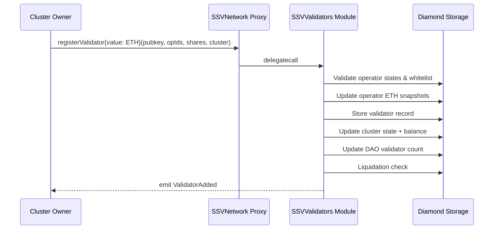
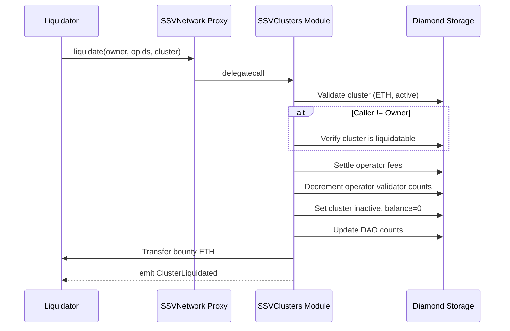
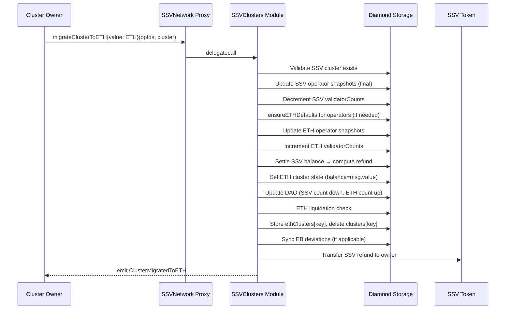
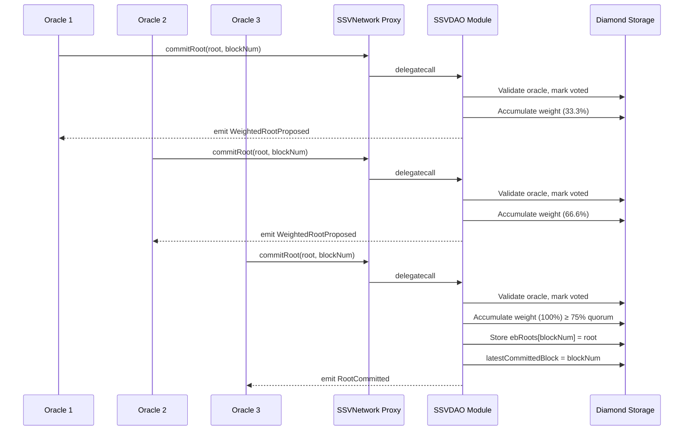
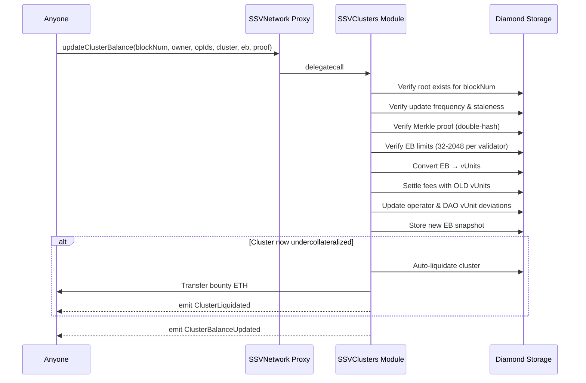
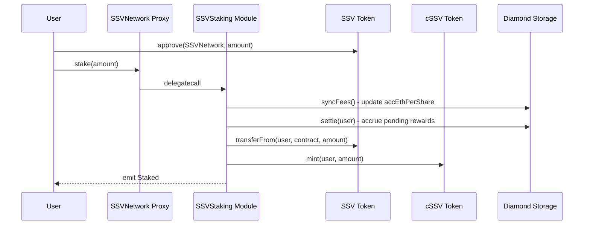
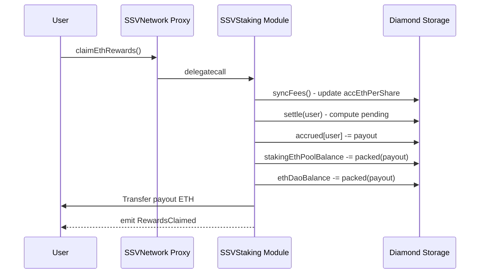
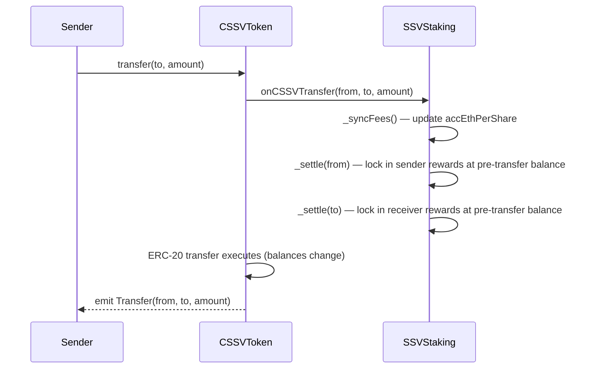

# SSV Network v2.0.0 — Contract Flows

This document describes every contract flow with preconditions, step-by-step state mutations, events, postconditions, and invariants. Use this as a verification checklist for testing and code review.

## Table of Contents

1. [Cluster Flows](#1-cluster-flows)
   - [Register Validator (ETH)](#11-register-validator-eth)
   - [Bulk Register Validators (ETH)](#12-bulk-register-validators-eth)
   - [Remove Validator](#13-remove-validator)
   - [Deposit ETH](#14-deposit-eth)
   - [Withdraw ETH](#15-withdraw-eth)
   - [Liquidate (ETH)](#16-liquidate-eth)
   - [Liquidate (SSV Legacy)](#17-liquidate-ssv-legacy)
   - [Reactivate](#18-reactivate)
2. [Migration Flows](#2-migration-flows)
   - [Migrate Cluster to ETH](#21-migrate-cluster-to-eth)
3. [Effective Balance Flows](#3-effective-balance-flows)
   - [Commit Root (Oracle)](#31-commit-root-oracle)
   - [Update Cluster Balance](#32-update-cluster-balance)
4. [Operator Flows](#4-operator-flows)
   - [Register Operator](#41-register-operator)
   - [Remove Operator](#42-remove-operator)
   - [Declare Operator Fee](#43-declare-operator-fee)
   - [Execute Operator Fee](#44-execute-operator-fee)
   - [Reduce Operator Fee](#45-reduce-operator-fee)
   - [Cancel Declared Operator Fee](#46-cancel-declared-operator-fee)
   - [Withdraw Operator Earnings (ETH)](#47-withdraw-operator-earnings-eth)
   - [Withdraw Operator Earnings (SSV)](#48-withdraw-operator-earnings-ssv)
5. [Staking Flows](#5-staking-flows)
   - [Stake SSV](#51-stake-ssv)
   - [Request Unstake](#52-request-unstake)
   - [Withdraw Unlocked](#53-withdraw-unlocked)
   - [Claim ETH Rewards](#54-claim-eth-rewards)
   - [Sync Fees](#55-sync-fees)
6. [DAO Governance Flows](#6-dao-governance-flows)
   - [Update Network Fee](#61-update-network-fee)
   - [Replace Oracle](#62-replace-oracle)

---

## 1. Cluster Flows

### 1.1 Register Validator (ETH)

**Caller:** Cluster owner (or new cluster creator)
**Payable:** Yes (msg.value = ETH to deposit)

#### Preconditions
- Public key length must be valid (48 bytes)
- Validator must not already exist
- Operator IDs must be sorted ascending, length 4–13
- All operators must exist and not be removed
- If operators are private, caller must be whitelisted
- If cluster doesn't exist, this creates a new ETH cluster
- If cluster exists, it must be an ETH cluster (VERSION_ETH)
- Cluster must be active (not liquidated)

#### State Mutations
1. For each operator:
   - Update ETH snapshot (accumulate earnings)
   - Increment `operator.ethValidatorCount`
   - If first ETH interaction: `ensureETHDefaults()` sets ethFee and ethSnapshot.block
2. Store validator: `validatorPKs[hash(pubkey, owner)] = hash(operatorIds | active=true)`
3. Update cluster state:
   - `cluster.validatorCount++`
   - `cluster.balance += msg.value`
   - `cluster.index = current cumulative operator ETH index`
   - `cluster.networkFeeIndex = current ETH network fee index`
4. Update DAO: `ethDaoValidatorCount++`, `daoTotalEthVUnits += VUNITS_PRECISION` — baseline EB of 32 ETH per validator is always applied here for all ETH clusters
5. If cluster has explicit EB (oracle has previously submitted an EB update): also update `ebSnapshot.vUnits` to include the new validators' baseline. Operator and DAO deviation vUnits are NOT updated — new validators start at exactly 32 ETH so their deviation is zero
6. Store cluster hash in `ethClusters`
7. Liquidation check: cluster must not be liquidatable after registration

#### Events
```solidity
emit ValidatorAdded(owner, operatorIds, publicKey, shares, cluster);
```

#### Postcondition Invariants
- `contract.balance == previous_contract_balance + msg.value`
- `operator.ethValidatorCount == previous + 1` for each operator
- `ethDaoValidatorCount == previous + 1`
- Cluster is not liquidatable
- Validator is retrievable via `getValidator(owner, publicKey)`



---

### 1.2 Bulk Register Validators (ETH)

Same as 1.1 but for multiple validators in one transaction. Each validator emits a separate `ValidatorAdded` event. `msg.value` is added to cluster balance once (not per validator).

#### Additional Invariants
- `contract.balance == previous + msg.value` (single ETH deposit)
- `operator.ethValidatorCount == previous + N` for each operator (N = number of validators)
- `ethDaoValidatorCount == previous + N`

---

### 1.3 Remove Validator

**Caller:** Cluster owner

#### Preconditions
- Validator must exist and be owned by caller
- Cluster must exist as ETH cluster (VERSION_ETH)
- Operator IDs must match the registered operator set

#### State Mutations (ETH cluster)
1. Update operator ETH snapshots
2. Decrement `operator.ethValidatorCount`
3. Delete validator record
4. Update cluster:
   - `cluster.validatorCount--`
   - Settle fees up to current block
   - Update indices
5. Update DAO: `ethDaoValidatorCount--`, reduce vUnits
6. If last validator removed: cluster balance remains (can withdraw later)

#### Events
```solidity
emit ValidatorRemoved(owner, operatorIds, publicKey, cluster);
```

#### Postcondition Invariants
- `operator.ethValidatorCount == previous - 1`
- `ethDaoValidatorCount == previous - 1`
- Validator no longer retrievable
- Cluster balance reflects settled fees

---

### 1.4 Deposit ETH

**Caller:** Anyone (on behalf of cluster owner)
**Payable:** Yes

#### Preconditions
- Cluster must exist as ETH cluster (VERSION_ETH)

> **Note — deposits allowed on liquidated clusters:** `deposit` does not require the cluster to be active. Depositing to a liquidated cluster, and later reactivating it, will accumulate both the deposit and the reactivation amount.

#### State Mutations
1. `cluster.balance += msg.value`
2. Update stored cluster hash

#### Events
```solidity
emit ClusterDeposited(owner, operatorIds, msg.value, cluster);
```

#### Postcondition Invariants
- `contract.balance == previous_contract_balance + msg.value`
- `cluster.balance == previous_settled_balance + msg.value`
- Cluster state hash is updated

```mermaid
sequenceDiagram
    participant Anyone as Depositor
    participant SSVNetwork as SSVNetwork Proxy
    participant Clusters as SSVClusters Module
    participant Storage as Diamond Storage

    Anyone->>SSVNetwork: deposit{value: ETH}(owner, opIds, cluster)
    SSVNetwork->>Clusters: delegatecall
    Clusters->>Storage: Validate cluster (ETH version; active not required)
    Clusters->>Storage: cluster.balance += msg.value
    Clusters->>Storage: Store updated cluster hash
    Clusters-->>Anyone: emit ClusterDeposited
```

---

### 1.5 Withdraw ETH

**Caller:** Cluster owner
**nonReentrant:** Yes

#### Preconditions
- Cluster must exist as ETH cluster (VERSION_ETH)
- Cluster must be active
- `amount <= cluster.balance` after fee settlement
- Cluster must not become liquidatable after withdrawal

#### State Mutations
1. Update operator snapshots
2. Settle cluster fees
3. `cluster.balance -= amount`
4. Liquidation check
5. Update stored cluster hash
6. Transfer `amount` ETH to caller

#### Events
```solidity
emit ClusterWithdrawn(owner, operatorIds, amount, cluster);
```

#### Postcondition Invariants
- `contract.balance == previous_contract_balance - amount`
- `cluster.balance == previous_settled_balance - amount`
- `owner.balance == previous_owner_balance + amount`
- Cluster is not liquidatable

---

### 1.6 Liquidate (ETH)

**Caller:** Anyone (self-liquidation always allowed; third-party only if cluster is liquidatable)
**nonReentrant:** Yes

#### Preconditions
- Cluster must exist as ETH cluster (VERSION_ETH)
- Cluster must be active
- If caller != owner: cluster must be liquidatable (balance below threshold)

#### State Mutations
1. Update operator snapshots with fee settlement
2. Decrement `operator.ethValidatorCount` for each operator
3. Compute liquidation bounty = remaining cluster balance
4. Set cluster state: `active = false, balance = 0, index = 0, networkFeeIndex = 0`
5. Update DAO: `ethDaoValidatorCount -= cluster.validatorCount`, reduce vUnits
6. Update stored cluster hash
7. Transfer bounty ETH to caller (liquidator)

#### Events
```solidity
emit ClusterLiquidated(owner, operatorIds, cluster);
```

#### Postcondition Invariants
- `cluster.active == false`
- `cluster.balance == 0`
- `operator.ethValidatorCount` decreased by cluster's validator count
- `ethDaoValidatorCount` decreased
- Liquidator received bounty ETH
- `contract.balance == previous - bounty`



---

### 1.7 Liquidate (SSV Legacy)

Same flow as 1.6 but for SSV clusters. Uses `s.clusters` instead of `s.ethClusters`. SSV balance transferred via SSV token transfer (not ETH).

---

### 1.8 Reactivate

**Caller:** Cluster owner
**Payable:** Yes (msg.value = ETH deposit)

#### Preconditions
- Cluster must exist as ETH cluster
- Cluster must be liquidated (`active == false`)


> **Note — Stale EB risk:** The solvency check on reactivation uses the stored `clusterEB.vUnits` snapshot, which may be stale if the beacon-chain EB changed while the cluster was liquidated. A liquidated cluster can still receive a permissionless `updateClusterBalance` call, and that call will refresh the EB snapshot even while inactive (fee/accounting updates are skipped). If no such update is submitted during the liquidation period and real EB has increased since liquidation (e.g. validator consolidation), the burn rate will jump on the next `updateClusterBalance` call after reactivation and the cluster may be immediately auto-liquidated. Cluster owners should deposit extra ETH buffer to account for potential EB drift.

#### State Mutations
1. Update operator ETH snapshots
2. Increment `operator.ethValidatorCount` for each operator
3. Set cluster: `active = true, balance = msg.value, index = current, networkFeeIndex = current`
4. Update DAO: `ethDaoValidatorCount += cluster.validatorCount`, add vUnits
5. Liquidation check: must not be immediately liquidatable (uses stored `clusterEB.vUnits`)
6. Update stored cluster hash

#### Events
```solidity
emit ClusterReactivated(owner, operatorIds, cluster);
```

#### Postcondition Invariants
- `cluster.active == true`
- `cluster.balance += msg.value`
- `contract.balance == previous + msg.value`
- Cluster is not liquidatable

---

## 2. Migration Flows

### 2.1 Migrate Cluster to ETH

**Caller:** Cluster owner
**Payable:** Yes (msg.value = ETH for new cluster balance)

#### Preconditions
- Cluster must exist in `s.clusters` (VERSION_SSV)
- Cluster can be active or liquidated — if liquidated, migration also reactivates it
- Caller must be cluster owner
- msg.value must be sufficient to pass ETH liquidation check

#### State Mutations

1. **Operator migration (for each operator):**
   - Update SSV snapshot (accumulate final SSV earnings)
   - Decrement `operator.validatorCount` (SSV count) — skip if cluster was liquidated
   - If first ETH interaction: `ensureETHDefaults()` (set ethFee, ethSnapshot.block)
   - Else: update ETH snapshot
   - Increment `operator.ethValidatorCount`

2. **Settle SSV balance:**
   - Compute remaining SSV balance after fees
   - Store as `ssvClusterBalance` for refund

3. **Set up ETH cluster:**
   - `cluster.balance = msg.value`
   - `cluster.active = true`
   - `cluster.index = cumulative ETH operator index`
   - `cluster.networkFeeIndex = current ETH network fee index`

4. **DAO accounting:**
   - If NOT previously liquidated: `sp.updateDAOSSV(false, validatorCount)` (reduce SSV DAO count)
   - Always: `sp.updateDAO(true, validatorCount)` (increase ETH DAO count + baseline vUnits)

5. **Liquidation check:** Verify ETH cluster is not liquidatable

6. **Store & delete:**
   - `s.ethClusters[key] = cluster.hashClusterData()`
   - `delete s.clusters[key]`

7. **EB deviation sync (if applicable):**
   - If cluster had explicit EB snapshot with vUnits > baseline:
     - Add deviation to `sp.daoTotalEthVUnits`
     - Add deviation to each `seb.operatorEthVUnits[operatorId]`

8. **Refund SSV:** Transfer remaining SSV balance to owner

#### Events
```solidity
emit ClusterMigratedToETH(owner, operatorIds, msg.value, ssvRefunded, effectiveBalance, cluster);

// If the SSV cluster was liquidated, migration also reactivates it:
if (isLiquidated) emit ClusterReactivated(owner, operatorIds, cluster);
```

#### Postcondition Invariants
- `s.clusters[key]` is deleted (no longer exists as SSV cluster)
- `s.ethClusters[key]` exists with new ETH cluster data
- `cluster.active == true`
- `cluster.balance == msg.value`
- `contract.balance == previous_contract_balance + msg.value`
- `owner SSV balance == previous + ssvRefunded`
- `operator.validatorCount` decreased (SSV), `operator.ethValidatorCount` increased (ETH) — net zero change in total validators
- `ethDaoValidatorCount` increased, `daoValidatorCount` decreased (unless was liquidated)
- Cluster is not liquidatable under ETH rules
- SSV cluster record is completely removed



---

## 3. Effective Balance Flows

### 3.1 Commit Root (Oracle)

**Caller:** Registered oracle only

#### Preconditions
- `oracleIdOf[msg.sender] != 0`
- `blockNum > latestCommittedBlock` (strictly monotonic)
- `blockNum <= block.number` (not future)
- `cSSV.totalSupply() > 0` (staking is active)
- Oracle has not already voted for this `(blockNum, merkleRoot)` pair

#### State Mutations

1. Mark oracle as voted: `hasVoted[commitmentKey][oracleId] = true`
2. Compute weight: `weight = totalCSSVSupply / defaultOracleIds.length`
3. Accumulate: `rootCommitments[commitmentKey] += weight`
4. Compute threshold: `threshold = (totalCSSVSupply * quorumBps) / 10_000`
5. **If quorum reached** (`accumulatedWeight >= threshold`):
   - Store root: `ebRoots[blockNum] = merkleRoot`
   - Update: `latestCommittedBlock = blockNum`
   - Cleanup: `delete rootCommitments[commitmentKey]`
6. **If quorum not reached**: no root storage

#### Events
```solidity
// If quorum reached:
emit RootCommitted(merkleRoot, blockNum);

// If quorum not reached:
emit WeightedRootProposed(merkleRoot, blockNum, accumulatedWeight, quorum, oracleId, oracle);
```

#### Postcondition Invariants
- If quorum reached: `ebRoots[blockNum] == merkleRoot`
- If quorum reached: `latestCommittedBlock == blockNum`
- Oracle cannot vote again for same `(blockNum, merkleRoot)`
- Total votes for this commitment <= oracle count



---

### 3.2 Update Cluster Balance

**Caller:** Anyone (permissionless)
**nonReentrant:** Yes

#### Preconditions
- Committed root exists for `blockNum`: `ebRoots[blockNum] != bytes32(0)`
- Update frequency check: `block.number >= lastUpdateBlock + minBlocksBetweenUpdates`
- Staleness check: `blockNum > lastRootBlockNum` (strictly increasing)
- Merkle proof valid: `verify(proof, ebRoots[blockNum], doubleHash(clusterId, effectiveBalance))`
- EB limits: `32 * validatorCount <= effectiveBalance <= 2048 * validatorCount`
- Cluster must exist (ETH or SSV)

> **Note — Liquidated clusters:** The EB snapshot (`clusterEB[clusterId].vUnits`) is **always updated** regardless of cluster state. Steps 3, 4, 6, and 7 are skipped when `cluster.active == false`. `ClusterBalanceUpdated` is still emitted. This keeps the stored EB current so that reactivation uses the latest known value rather than a stale one.

#### State Mutations (ETH Cluster)

1. Convert `effectiveBalance` to `newVUnits = ebToVUnits(effectiveBalance)`
2. Compute `effectiveOldVUnits`:
   - If `storedVUnits == 0`: `validatorCount * VUNITS_PRECISION`
   - Else: `storedVUnits`
3. If cluster active: settle operator and network fees using OLD vUnits
4. If `newVUnits != effectiveOldVUnits` AND cluster active:
   - For each operator: `operatorEthVUnits[opId] += (newVUnits - effectiveOldVUnits)` — **full delta applied to every operator, no division by operator count**
   - `daoTotalEthVUnits += (newVUnits - effectiveOldVUnits)`
5. Update EB snapshot: `{vUnits: newVUnits, lastRootBlockNum: blockNum, lastUpdateBlock: block.number}`
6. **Auto-liquidation check** (active clusters only): if cluster now undercollateralized:
   - Liquidate immediately (same as liquidate flow)
   - Bounty goes to `msg.sender` (updater)
7. If not liquidated: store updated cluster hash

#### State Mutations (SSV Cluster)
- Only stores EB snapshot (no balance/fee updates)
- Prepares data for future migration

#### Events
```solidity
emit ClusterBalanceUpdated(owner, operatorIds, blockNum, effectiveBalance, cluster);

// If auto-liquidated:
emit ClusterLiquidated(owner, operatorIds, cluster);
```

#### Postcondition Invariants
- `clusterEB[clusterId].vUnits == newVUnits`
- `clusterEB[clusterId].lastRootBlockNum == blockNum`
- `clusterEB[clusterId].lastUpdateBlock == block.number`
- If EB increased: future fee accrual is higher
- If EB decreased: future fee accrual is lower
- Sum of all `operatorEthVUnits` deviations + baselines == `daoTotalEthVUnits`
- If auto-liquidated: `cluster.active == false`, bounty transferred to caller



---

## 4. Operator Flows

### 4.1 Register Operator

**Caller:** Anyone

#### Preconditions
- Public key must not already be registered
- Fee must be divisible by ETH_DEDUCTED_DIGITS (100,000)
- Fee must be within `[minimumOperatorEthFee, operatorMaxFee]`

#### State Mutations
1. Increment `lastOperatorId`
2. Store operator: `{owner: msg.sender, ethFee: packed(fee), ethSnapshot: {block: block.number, index: 0, balance: 0}}`
3. Store public key mapping
4. If `setPrivate`: mark operator as whitelisted

#### Events
```solidity
emit OperatorAdded(operatorId, msg.sender, publicKey, fee);
if (setPrivate) emit OperatorPrivacyStatusUpdated([operatorId], true);
```

#### Postcondition Invariants
- `lastOperatorId == previous + 1`
- `operators[id].owner == msg.sender`
- `operators[id].ethFee == packed(fee)`
- `operators[id].validatorCount == 0` (SSV)
- `operators[id].ethValidatorCount == 0` (ETH)

---

### 4.2 Remove Operator

**Caller:** Operator owner
**nonReentrant:** Yes

#### Preconditions
- Operator must exist (`snapshot.block != 0 || ethSnapshot.block != 0`)
- Caller must be operator owner
- Operator must have 0 validators in BOTH SSV and ETH counts

#### State Mutations
1. Update SSV snapshot (final earnings)
2. Update ETH snapshot (final earnings)
3. Reset operator state via `_resetOperatorState`: zeros `ethSnapshot`, `snapshot`, `ethFee`, `fee`, `ethValidatorCount`, `validatorCount`
4. **`operator.owner` is intentionally preserved** — allows off-chain systems (explorer, `getOperatorById`) to query the original owner after removal
5. Withdraw all SSV earnings to owner (if any)
6. Withdraw all ETH earnings to owner (if any)
7. Delete whitelist mapping
8. Delete fee change request (if any)

#### Events
```solidity
if (ssvEarnings > 0) emit OperatorWithdrawnSSV(owner, operatorId, ssvEarnings);
if (ethEarnings > 0) emit OperatorWithdrawn(owner, operatorId, ethEarnings);
emit OperatorRemoved(operatorId);
```

#### Removed Operator Detection

After removal, different code paths detect removed operators via different checks — all are consistent:

| Check | Location | How it detects removed operators |
|-------|----------|--------------------------------|
| `checkOwner` | `OperatorLib.sol:131` | `snapshot.block == 0 && ethSnapshot.block == 0` → reverts `OperatorDoesNotExist` |
| `ensureOperatorExist` | `OperatorLib.sol:159` | `owner == address(0)` OR `(ethSnapshot.block == 0 && snapshot.block == 0)` → reverts (catches via second condition since owner is preserved) |
| `getSSVBurnRate` | `SSVViews.sol:356` | `owner != address(0)` — removed operators pass this but contribute zero fee (fee already zeroed) |
| `getOperatorById` | `SSVViews.sol:83` | Returns preserved `owner`; `isActive = false` (`ethSnapshot.block == 0`) |

#### Postcondition Invariants
- `operators[id].owner` preserves the original owner address (non-zero)
- All other operator fields are zeroed: snapshots, fees, validator counts
- No earnings remain in the system for this operator
- Public key can be re-registered

---

### 4.3 Declare Operator Fee

**Caller:** Operator owner

#### Preconditions
- Operator must exist
- New fee within `[minimumOperatorEthFee, operatorMaxFee]`
- Fee increase limited by `operatorMaxFeeIncrease` (percentage)
- Cannot increase if both SSV fee = 0 AND ETH fee = 0

> **Note — Existing pre-upgrade declarations:** Previous declarations (before the upgrade timestamp, `UPGRADE_TIMESTAMP` in `SSVOperators`) are rejected when executing the fee update via `executeOperatorFee`. The operator owner can declare a new fee at any time.

#### State Mutations
1. Store `OperatorFeeChangeRequest{fee: packed(newFee), approvalBeginTime: now + declarePeriod, approvalEndTime: now + declarePeriod + executePeriod}`

#### Events
```solidity
emit OperatorFeeDeclared(owner, operatorId, block.number, fee);
```

---

### 4.4 Execute Operator Fee

**Caller:** Operator owner

#### Preconditions
- Pending fee change request exists
- `approvalBeginTime > UPGRADE_TIMESTAMP` (reject pre-migration declarations)
- Current time within `[approvalBeginTime, approvalEndTime]`
- Fee still within `operatorMaxFee`

#### State Mutations
1. Update operator ETH snapshot (settles all pending earnings at the **old** fee up to this block; the new fee only applies to blocks going forward — no retroactive impact on cluster index calculations)
2. Set `operator.ethFee = request.fee` (packed)
3. Delete fee change request

#### Events
```solidity
emit OperatorFeeExecuted(owner, operatorId, block.number, fee);
```

#### Postcondition Invariants
- `operator.ethFee == request.fee` (packed)
- No pending fee change request
- ETH snapshot block updated to current

---

### 4.5 Reduce Operator Fee

**Caller:** Operator owner (immediate, no timelock)

#### Preconditions
- New fee within `[minimumOperatorEthFee, currentFee)`
- New fee strictly less than current

#### State Mutations
1. Update operator ETH snapshot (settles all pending earnings at the **old** fee up to this block; the new fee only applies to blocks going forward — no retroactive impact on cluster index calculations)
2. Set `operator.ethFee = packed(newFee)`
3. Delete any pending fee change request

#### Events
```solidity
emit OperatorFeeExecuted(owner, operatorId, block.number, fee);
```

---

### 4.6 Cancel Declared Operator Fee

**Caller:** Operator owner

#### Preconditions
- Operator must exist
- Caller must be operator owner
- A pending fee change request must exist (`approvalBeginTime != 0`)

#### State Mutations
1. Delete the pending `OperatorFeeChangeRequest` for this operator

#### Events
```solidity
emit OperatorFeeDeclarationCancelled(owner, operatorId);
```

#### Postcondition Invariants
- No pending fee change request for this operator
- Operator's current fee is unchanged

---

### 4.7 Withdraw Operator Earnings (ETH)

**Caller:** Operator owner
**nonReentrant:** Yes

#### Preconditions
- Operator must exist
- `amount <= accumulated ETH earnings`

#### State Mutations
1. Update ETH snapshot (accumulate latest earnings)
2. Deduct `amount` from snapshot balance
3. Transfer `amount` ETH to operator owner

#### Events
```solidity
emit OperatorWithdrawn(owner, operatorId, amount);
```

#### Postcondition Invariants
- `operator.ethSnapshot.balance == previous_settled - amount`
- `owner.balance == previous + amount`
- `contract.balance == previous - amount`

---

### 4.8 Withdraw Operator Earnings (SSV)

Same as 4.7 but for SSV-denominated earnings. SSV token transferred instead of ETH.

#### Events
```solidity
emit OperatorWithdrawnSSV(owner, operatorId, amount);
```

---

### 4.9 Withdraw All Operator Earnings (ETH + SSV)

**Caller:** Operator owner
**nonReentrant:** Yes

#### Preconditions
- Operator must exist

#### State Mutations
1. Update both ETH and SSV snapshots (accumulate latest earnings for both)
2. Deduct full ETH balance from `ethSnapshot.balance` (set to zero)
3. Deduct full SSV balance from `snapshot.balance` (set to zero)
4. Transfer full ETH earnings to operator owner (if non-zero)
5. Transfer full SSV token earnings to operator owner (if non-zero)

#### Events
```solidity
emit OperatorWithdrawn(owner, operatorId, ethAmount);  // ETH portion
emit OperatorWithdrawnSSV(owner, operatorId, ssvAmount);  // SSV portion
```

#### Postcondition Invariants
- `operator.ethSnapshot.balance == 0`
- `operator.snapshot.balance == 0`
- `owner.balance == previous + ethEarnings`
- `owner.ssvBalance == previous + ssvEarnings`
- `contract.balance == previous - ethEarnings`

---

## 5. Staking Flows

### 5.1 Stake SSV

**Caller:** Anyone with SSV tokens
**nonReentrant:** Yes

#### Preconditions
- `amount > 0`
- `amount >= MINIMAL_STAKING_AMOUNT` (1,000,000,000)
- User has approved SSV token transfer to contract

> **Note — cSSV supply cap:** `cSSV.totalSupply` can never exceed `SSV.totalSupply` by construction. `mint(amount)` is only called after `transferFrom` succeeds, so cSSV is always backed 1:1 by SSV already held in the contract. No explicit supply cap check is needed.

#### State Mutations
1. `_syncFees()`: Update `accEthPerShare` with latest DAO ETH earnings
2. `_settle(msg.sender)`: Settle pending rewards for user
3. Transfer `amount` SSV tokens from user to contract
4. Mint `amount` cSSV to user

#### Events
```solidity
emit FeesSynced(newFeesWei, accEthPerShare);
emit RewardsSettled(user, pending, accrued, userIndex);
emit Staked(user, amount);
```

#### Postcondition Invariants
- `cSSV.totalSupply() == previous + amount`
- `cSSV.balanceOf(user) == previous + amount`
- `ssvToken.balanceOf(contract) == previous + amount`
- `ssvToken.balanceOf(user) == previous - amount`
- `userIndex[user] == accEthPerShare` (freshly settled)
- User begins earning pro-rata rewards immediately



---

### 5.2 Request Unstake

**Caller:** cSSV holder
**nonReentrant:** Yes

#### Preconditions
- `amount > 0`
- `amount <= cSSV.balanceOf(msg.sender)`
- Pending unstake requests < MAX_PENDING_REQUESTS (2000)

#### State Mutations
1. `_syncFees()`: Update `accEthPerShare`
2. `_settleWithBalance(user, balance)`: Settle rewards using CURRENT cSSV balance (before burn)
3. Push `UnstakeRequest{amount, unlockTime: block.timestamp + cooldownDuration}`
4. Burn `amount` cSSV from user

#### Events
```solidity
emit FeesSynced(newFeesWei, accEthPerShare);
emit RewardsSettled(user, pending, accrued, userIndex);
emit UnstakeRequested(user, amount, unlockTime);
```

#### Postcondition Invariants
- `cSSV.totalSupply() == previous - amount`
- `cSSV.balanceOf(user) == previous - amount`
- `withdrawalRequests[user].length == previous + 1`
- Rewards STOP accruing for the burned cSSV portion
- Previously accrued rewards remain claimable
- SSV tokens are NOT yet returned (locked until cooldown)

---

### 5.3 Withdraw Unlocked

**Caller:** User with matured unstake requests
**nonReentrant:** Yes

#### Preconditions
- At least one `UnstakeRequest` where `unlockTime <= block.timestamp` — reverts with `NothingToWithdraw` if none exist or all are still within cooldown

#### State Mutations
1. Iterate **all** withdrawal requests in a single pass; remove every matured entry via swap-and-pop (O(1) per removal, order of remaining entries may change)
2. Sum total unlocked amount across all removed entries
3. Transfer `totalAmount` SSV tokens to user

> **Note:** A single `withdrawUnlocked` call drains **all** matured requests at once — there is no per-request granularity. Immature requests remain untouched in the array.

#### Events
```solidity
emit UnstakedWithdrawn(user, totalAmount);
```

#### Postcondition Invariants
- `ssvToken.balanceOf(user) == previous + totalAmount`
- `ssvToken.balanceOf(contract) == previous - totalAmount`
- All matured requests removed from array
- Immature requests preserved

---

### 5.4 Claim ETH Rewards

**Caller:** cSSV holder
**nonReentrant:** Yes

#### Preconditions
- User has accrued rewards > 0 (after truncation to ETH_DEDUCTED_DIGITS)

#### State Mutations
1. `_syncFees()`: Update `accEthPerShare`
2. `_settle(user)`: Settle latest rewards
3. Compute payout: `payout = accrued - (accrued % 100_000)` (precision truncation)
4. Deduct from `accrued[user]`
5. Deduct from `stakingEthPoolBalance` (packed)
6. Deduct from `sp.ethDaoBalance` (packed)
7. Transfer `payout` ETH to user

#### Events
```solidity
emit FeesSynced(newFeesWei, accEthPerShare);
emit RewardsSettled(user, pending, accrued, userIndex);
emit RewardsClaimed(user, payout);
```

#### Postcondition Invariants
- `user.balance == previous + payout`
- `contract.balance == previous - payout`
- `accrued[user] == previous_accrued - payout` (may have dust remainder < 100,000)
- `stakingEthPoolBalance` decreased by packed(payout)
- `ethDaoBalance` decreased by packed(payout)



---

### 5.5 Sync Fees

**Caller:** Anyone
**nonReentrant:** Yes

#### Purpose
Publicly callable function to update the global `accEthPerShare` without settling any specific user. Useful for keeping the accumulator current.

#### State Mutations
1. Compute current DAO ETH earnings
2. If new fees since last sync: update `accEthPerShare` and `stakingEthPoolBalance`

#### Events
```solidity
emit FeesSynced(newFeesWei, accEthPerShare);
```

---

### 5.6 cSSV Transfer (Reward Settlement Hook)

**Caller:** Any cSSV holder (triggered automatically on ERC-20 transfer)
**nonReentrant:** No (hook is called from within the cSSV token contract)

#### Purpose
Ensures that rewards accrued by the sender up to the moment of transfer remain claimable by the sender, and that the receiver starts accruing rewards only from the moment they receive cSSV. Without this hook, a receiver could claim rewards earned before they held the tokens.

#### Hook Trigger
`CSSVToken._beforeTokenTransfer` calls `SSVStaking.onCSSVTransfer(from, to, amount)` before every transfer, **except**:
- Mint (`from == address(0)`)
- Burn (`to == address(0)`)
- Self-transfer (`from == to`)
- Calls originating from the staking contract itself (`msg.sender == ssvStaking`) — covers internal mint/burn during `stake` and `requestUnstake`

#### State Mutations
1. `_syncFees()`: Update global `accEthPerShare` with latest DAO ETH earnings
2. `_settle(from)`: Snapshot sender's accrued rewards at current `accEthPerShare` using their **pre-transfer** balance
3. `_settle(to)`: Snapshot receiver's accrued rewards at current `accEthPerShare` using their **pre-transfer** balance

After the hook returns, the ERC-20 transfer executes, changing both balances. Future `_settle` calls will compute rewards from the new balances, but only from this block forward.

#### Events
None emitted by the hook itself. The ERC-20 `Transfer` event is emitted by the token contract after the hook.

#### Postcondition Invariants
- `userIndex[from] == accEthPerShare` (sender's rewards locked in at pre-transfer share)
- `userIndex[to] == accEthPerShare` (receiver starts accruing from now, not before)
- `accrued[from]` includes all rewards earned up to this block
- `accrued[to]` includes all rewards earned up to this block (on their existing balance, if any)
- If sender's cSSV balance reaches 0 after the transfer, `accrued[from]` is still non-zero and fully claimable via `claimEthRewards()` — rewards are stored in `accrued` independently of cSSV balance



---

## 6. DAO Governance Flows

### 6.1 Update Network Fee

**Caller:** Owner only

#### State Mutations
1. Settle current ETH DAO earnings up to current block
2. Update `ethNetworkFee` to new value
3. Update `ethNetworkFeeIndex` to current
4. Update `ethNetworkFeeIndexBlockNumber` to current block

#### Events
```solidity
emit NetworkFeeUpdated(oldFee, newFee);
```

#### Postcondition Invariants
- All fee accrual up to this block uses old fee
- All fee accrual from this block forward uses new fee
- DAO earnings are settled (no gap or double-counting)

---

### 6.2 Replace Oracle

**Caller:** Owner only

#### State Mutations
1. Clear old oracle's `oracleIdOf` mapping
2. Set new oracle's `oracleIdOf` mapping
3. Update `oracles[oracleId]` to new address

#### Events
```solidity
emit OracleReplaced(oracleId, oldOracle, newOracle);
```

#### Postcondition Invariants
- Old oracle can no longer call `commitRoot`
- New oracle can call `commitRoot`
- Outstanding votes by old oracle for pending commitments remain counted

---

## Global Invariants (Must Always Hold)

These invariants should be verified across all flows:

1. **ETH conservation**: `contract.ETH_balance >= Σ(all active ETH cluster balances) + Σ(all operator ETH earnings) + staking_pool_balance`
2. **SSV conservation**: `contract.SSV_balance >= Σ(all active SSV cluster balances) + Σ(all operator SSV earnings) + Σ(staked SSV)`
3. **Validator count consistency**: `ethDaoValidatorCount == Σ(cluster.validatorCount)` across all active ETH clusters — note: `Σ(operator.ethValidatorCount)` is NOT equivalent because operators are shared across clusters and would double-count
4. **vUnit consistency**: `daoTotalEthVUnits == ethDaoValidatorCount * VUNITS_PRECISION + Σ(cluster_deviations)`
5. **Cluster hash integrity**: Every cluster operation must end with `s.ethClusters[key] = cluster.hashClusterData()` matching the actual cluster state
6. **cSSV supply**: `cSSV.totalSupply() == Σ(all staked SSV that has not been unstake-requested)`
7. **Rewards conservation**: `accEthPerShare` only increases, never decreases
8. **Oracle monotonicity**: `latestCommittedBlock` only increases
9. **Cluster version exclusivity**: A cluster key exists in EITHER `s.clusters` OR `s.ethClusters`, never both
10. **Operator dual tracking**: SSV validatorCount + ETH validatorCount == total validators using this operator
