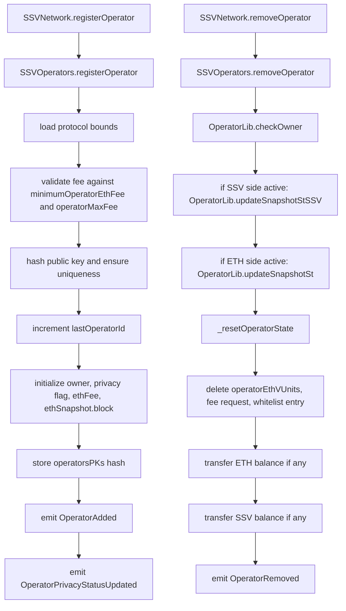
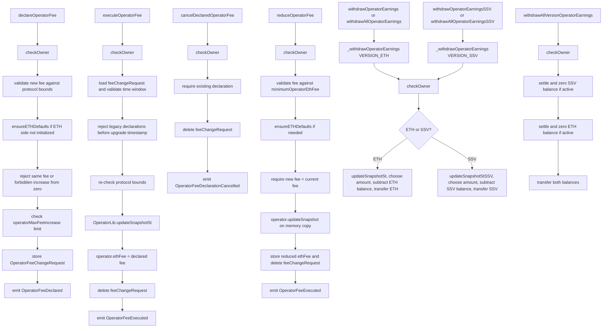
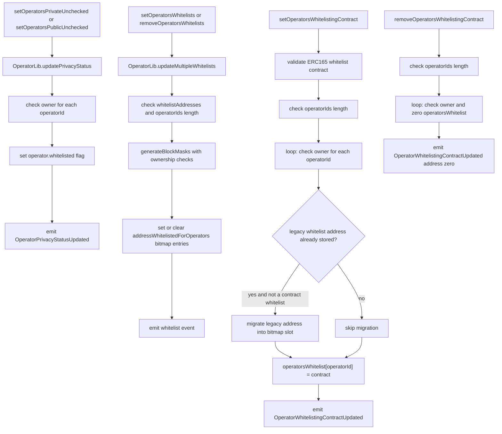

# SSV Network v2.0.0 - Internal Operators Analysis

This document extracts the operator and whitelist material from [FLOW_DIAGRAMS.md](./FLOW_DIAGRAMS.md). It includes the operator-facing diagrams, entrypoint mapping, helper summaries, and the detailed line-by-line audits for the operator module paths.

Section numbering is preserved from the original flow-diagram document so existing `4.x` references remain stable.

## 4. Operator And Whitelist Flows

The operator-facing surface is split across the `SSVOperators` module and the `SSVOperatorsWhitelist` module. `SSVNetwork` delegates those selectors into the module wrappers in `contracts/SSVNetwork.sol`.

### 4.1 Operator-Callable Surface

Operator-facing entrypoints:

- Lifecycle: `registerOperator`, `removeOperator`
- Fee management: `declareOperatorFee`, `executeOperatorFee`, `cancelDeclaredOperatorFee`, `reduceOperatorFee`
- Privacy: `setOperatorsPrivateUnchecked`, `setOperatorsPublicUnchecked`
- Earnings: `withdrawOperatorEarnings`, `withdrawAllOperatorEarnings`, `withdrawAllVersionOperatorEarnings`, `withdrawOperatorEarningsSSV`, `withdrawAllOperatorEarningsSSV`
- Whitelist management: `setOperatorsWhitelists`, `removeOperatorsWhitelists`, `setOperatorsWhitelistingContract`, `removeOperatorsWhitelistingContract`

Access model:

- `registerOperator` is open to any caller.
- Every other operator-facing function is owner-gated through `OperatorLib.checkOwner`, either directly on one operator or by looping over all provided operator IDs.

#### Starting Points

Start from the external selector on `SSVNetwork`, then follow the delegate call into the implementation module:

| Function | Entry | Implementation |
|---|---|---|
| `registerOperator(bytes,uint256,bool)` | [`contracts/SSVNetwork.sol#L112`](../contracts/SSVNetwork.sol#L112) | [`contracts/modules/SSVOperators.sol#L31`](../contracts/modules/SSVOperators.sol#L31) |
| `removeOperator(uint64)` | [`contracts/SSVNetwork.sol#L120`](../contracts/SSVNetwork.sol#L120) | [`contracts/modules/SSVOperators.sol#L71`](../contracts/modules/SSVOperators.sol#L71) |
| `setOperatorsWhitelists(uint64[],address[])` | [`contracts/SSVNetwork.sol#L124`](../contracts/SSVNetwork.sol#L124) | [`contracts/modules/SSVOperatorsWhitelist.sol#L15`](../contracts/modules/SSVOperatorsWhitelist.sol#L15) |
| `removeOperatorsWhitelists(uint64[],address[])` | [`contracts/SSVNetwork.sol#L131`](../contracts/SSVNetwork.sol#L131) | [`contracts/modules/SSVOperatorsWhitelist.sol#L26`](../contracts/modules/SSVOperatorsWhitelist.sol#L26) |
| `setOperatorsWhitelistingContract(uint64[],ISSVWhitelistingContract)` | [`contracts/SSVNetwork.sol#L138`](../contracts/SSVNetwork.sol#L138) | [`contracts/modules/SSVOperatorsWhitelist.sol#L37`](../contracts/modules/SSVOperatorsWhitelist.sol#L37) |
| `setOperatorsPrivateUnchecked(uint64[])` | [`contracts/SSVNetwork.sol#L145`](../contracts/SSVNetwork.sol#L145) | [`contracts/modules/SSVOperators.sol#L221`](../contracts/modules/SSVOperators.sol#L221) |
| `setOperatorsPublicUnchecked(uint64[])` | [`contracts/SSVNetwork.sol#L149`](../contracts/SSVNetwork.sol#L149) | [`contracts/modules/SSVOperators.sol#L229`](../contracts/modules/SSVOperators.sol#L229) |
| `removeOperatorsWhitelistingContract(uint64[])` | [`contracts/SSVNetwork.sol#L153`](../contracts/SSVNetwork.sol#L153) | [`contracts/modules/SSVOperatorsWhitelist.sol#L75`](../contracts/modules/SSVOperatorsWhitelist.sol#L75) |
| `declareOperatorFee(uint64,uint256)` | [`contracts/SSVNetwork.sol#L157`](../contracts/SSVNetwork.sol#L157) | [`contracts/modules/SSVOperators.sol#L109`](../contracts/modules/SSVOperators.sol#L109) |
| `executeOperatorFee(uint64)` | [`contracts/SSVNetwork.sol#L161`](../contracts/SSVNetwork.sol#L161) | [`contracts/modules/SSVOperators.sol#L146`](../contracts/modules/SSVOperators.sol#L146) |
| `cancelDeclaredOperatorFee(uint64)` | [`contracts/SSVNetwork.sol#L165`](../contracts/SSVNetwork.sol#L165) | [`contracts/modules/SSVOperators.sol#L180`](../contracts/modules/SSVOperators.sol#L180) |
| `reduceOperatorFee(uint64,uint256)` | [`contracts/SSVNetwork.sol#L169`](../contracts/SSVNetwork.sol#L169) | [`contracts/modules/SSVOperators.sol#L194`](../contracts/modules/SSVOperators.sol#L194) |
| `withdrawOperatorEarnings(uint64,uint256)` | [`contracts/SSVNetwork.sol#L173`](../contracts/SSVNetwork.sol#L173) | [`contracts/modules/SSVOperators.sol#L237`](../contracts/modules/SSVOperators.sol#L237) |
| `withdrawAllOperatorEarnings(uint64)` | [`contracts/SSVNetwork.sol#L177`](../contracts/SSVNetwork.sol#L177) | [`contracts/modules/SSVOperators.sol#L244`](../contracts/modules/SSVOperators.sol#L244) |
| `withdrawAllVersionOperatorEarnings(uint64)` | [`contracts/SSVNetwork.sol#L181`](../contracts/SSVNetwork.sol#L181) | [`contracts/modules/SSVOperators.sol#L251`](../contracts/modules/SSVOperators.sol#L251) |
| `withdrawOperatorEarningsSSV(uint64,uint256)` | [`contracts/SSVNetwork.sol#L185`](../contracts/SSVNetwork.sol#L185) | [`contracts/modules/SSVOperators.sol#L282`](../contracts/modules/SSVOperators.sol#L282) |
| `withdrawAllOperatorEarningsSSV(uint64)` | [`contracts/SSVNetwork.sol#L189`](../contracts/SSVNetwork.sol#L189) | [`contracts/modules/SSVOperators.sol#L289`](../contracts/modules/SSVOperators.sol#L289) |

### 4.2 Operator Lifecycle

### 4.3 Fee Management And Earnings

### 4.4 Privacy And Whitelists

### 4.5 Shared Operator Helpers

These are the helper paths most relevant to operator-facing calls:

| Helper | Role |
|---|---|
| `OperatorLib.checkOwner` | Confirms the operator exists and that `msg.sender` is its owner |
| `OperatorLib.ensureETHDefaults` | Lazily initializes ETH-side snapshot fields and may assign default ETH fee for migrated legacy operators |
| `OperatorLib.updateSnapshotSt` | Settles ETH earnings using baseline validator count plus stored EB deviation |
| `OperatorLib.updateSnapshotStSSV` | Settles legacy SSV earnings using `validatorCount` and `fee` |
| `OperatorLib.updatePrivacyStatus` | Loops operator IDs, checks owner, flips the privacy flag |
| `OperatorLib.updateMultipleWhitelists` | Validates addresses, builds bitmasks, then sets or clears bitmap whitelist entries |

### 4.6 Detailed Audit - `registerOperator`

Audit posture for this path:

- No issue: operator public keys are intentionally never freed after removal; `operatorsPKs` preserves uniqueness/history.
- No issue: the `uint64` operator ID space is intentionally treated as practically unreachable for overflow in production.

#### Module Body

| Lines | Explanation | Possible problem / audit note |
|---|---|---|
| `31-35` | Declares the external module entrypoint, parameters, and returned operator ID. | No issue. |
| `36` | Loads protocol-level config and fee bounds from `SSVStorageProtocol`. | No issue. |
| `38-40` | Rejects non-zero fees below `minimumOperatorEthFee`. Zero-fee operators are explicitly allowed. | No issue. |
| `41-43` | Rejects fees above `operatorMaxFee`. | No issue. |
| `45` | Loads main protocol state from `SSVStorage`. | No issue. |
| `47` | Hashes the supplied operator public key for uniqueness tracking. | No issue in current design. The key is treated as opaque bytes and is not format-validated here. |
| `48` | Rejects duplicate operator keys using `operatorsPKs`. | No issue. Key retention after removal is intentional. |
| `50` | Increments the global operator counter. | No issue. |
| `51` | Reads the current counter value and narrows it to `uint64`. | No issue under the current production assumptions about operator count. |
| `52` | Gets the storage slot for the new operator struct. | No issue. |
| `54` | Stores `msg.sender` as the operator owner. | No issue. |
| `55` | Stores the initial privacy flag. | No issue. |
| `56` | Packs the ETH fee into the protocol's reduced-precision storage representation. | No issue. Precision enforcement is intentional. |
| `58` | Initializes the ETH snapshot block to the current block. | No issue. |
| `59` | Stores `keccak256(publicKey) -> operatorId` in the uniqueness map. | No issue. This intentionally keeps the key reserved for protocol history and uniqueness. |
| `61` | Allocates a one-element array for the privacy event payload. | No issue. |
| `62` | Writes the new operator ID into that array. | No issue. |
| `64` | Emits `OperatorAdded`. | No issue. |
| `65` | Emits `OperatorPrivacyStatusUpdated`. | No issue. |
| `66` | Function end. | No issue. |

#### Internal Calls Reached By This Path

`SSVStorageProtocol.load`

| Lines | Explanation | Possible problem / audit note |
|---|---|---|
| `66-71` | Returns a storage pointer bound to the fixed unstructured-storage slot for protocol config/state. | No issue. Standard unstructured-storage pattern. |

`SSVStorage.load`

| Lines | Explanation | Possible problem / audit note |
|---|---|---|
| `50-55` | Returns a storage pointer bound to the fixed unstructured-storage slot for main protocol state. | No issue. Standard unstructured-storage pattern. |

`PackedETHLib.pack`

| Lines | Explanation | Possible problem / audit note |
|---|---|---|
| `60-62` | Wraps `_pack(value, ETH_DEDUCTED_DIGITS)` to store ETH-denominated values in scaled `uint64` form. | No issue. |
| `9-10` | Rejects values that would overflow the packed `uint64` after scaling. | No issue. |
| `11` | Rejects values that are not divisible by `ETH_DEDUCTED_DIGITS`. | No issue. This is intended precision enforcement. |
| `13` | Returns the scaled-down raw value. | No issue. |

`PackedETHLib.unpack`

| Lines | Explanation | Possible problem / audit note |
|---|---|---|
| `64-66` | Expands packed ETH config values back to full precision for fee comparisons. | No issue. |
| `16-17` | Performs the raw-to-full-scale multiplication. | No issue. |

`Counters.increment` and `Counters.current`

| Lines | Explanation | Possible problem / audit note |
|---|---|---|
| `26-30` | Increments the operator counter using unchecked arithmetic. | No issue in current design assumptions. |
| `22-24` | Returns the current counter value. | No issue. |

### 4.7 Detailed Audit - `removeOperator`

Audit posture for this path:

- No findings under the current intended design.
- Design note: removal preserves `owner` and preserves public-key reservation; removal zeroes activity, fees, balances, counts, fee requests, whitelist pointer, and EB deviation.

#### Module Body

| Lines | Explanation | Possible problem / audit note |
|---|---|---|
| `71` | Declares the external module entrypoint and applies `nonReentrant`. | No issue. Reentrancy protection is appropriate because the path can transfer ETH and ERC20. |
| `72` | Loads main protocol storage. | No issue. |
| `73` | Gets the storage reference for the target operator. | No issue. |
| `74` | Loads EB storage so operator deviation can be cleared. | No issue. |
| `76` | Verifies the operator exists and that `msg.sender` is the owner. | No issue. |
| `78-79` | Initializes local variables used to capture withdrawable ETH and SSV balances before state reset. | No issue. |
| `81-84` | If the legacy SSV side is active, settles the SSV snapshot and captures the full SSV balance. | No issue. |
| `86-89` | If the ETH side is active, settles the ETH snapshot and captures the full ETH balance. | No issue. |
| `91` | Resets operator runtime state: snapshots, fees, and validator counts are zeroed. | No issue. Owner is intentionally preserved. |
| `93` | Deletes the operator's EB deviation entry. | No issue. |
| `94` | Deletes any pending fee change request. | No issue. |
| `95` | Deletes the legacy whitelist pointer. | No issue. Bitmap-based whitelist entries are intentionally not scrubbed here. |
| `97-99` | If ETH balance is non-zero, transfers the full ETH amount to the owner and emits `OperatorWithdrawn`. | No issue. A failed transfer reverts the whole transaction. |
| `100-102` | If SSV balance is non-zero, transfers the full token amount to the owner and emits `OperatorWithdrawnSSV`. | No issue. A failed transfer reverts the whole transaction. |
| `103` | Emits `OperatorRemoved`. | No issue. |
| `104` | Function end. | No issue. |

#### Internal Calls Reached By This Path

`OperatorLib.checkOwner`

| Lines | Explanation | Possible problem / audit note |
|---|---|---|
| `111-114` | Reverts with `OperatorDoesNotExist` if both snapshot blocks are zero, which is how removed operators are detected. | No issue. This is the intended removed-operator gate. |
| `115` | Reverts unless `msg.sender` matches the preserved `owner`. | No issue. |
| `116` | Helper end. | No issue. |

`OperatorLib.updateSnapshotStSSV`

| Lines | Explanation | Possible problem / audit note |
|---|---|---|
| `39-40` | Computes newly accrued SSV fee units since the last snapshot block. | No issue. |
| `42` | Advances the operator's cumulative SSV index. | No issue. |
| `43` | Accrues SSV earnings into `snapshot.balance` using `validatorCount * feeDelta`. | No issue. |
| `44` | Advances the snapshot block to the current block. | No issue. |
| `45` | Helper end. | No issue. |

`OperatorLib.updateSnapshotSt`

| Lines | Explanation | Possible problem / audit note |
|---|---|---|
| `56` | Loads EB storage to read operator deviation. | No issue. |
| `57-58` | Computes the ETH fee delta since the last ETH snapshot block. | No issue. |
| `63-64` | Reconstructs effective vUnits as baseline validator count plus stored deviation. | No issue. |
| `66` | Advances the operator's cumulative ETH index. | No issue. |
| `67-70` | If both fee delta and effective vUnits are non-zero, accrues ETH earnings into the snapshot balance. | No issue. |
| `71` | Advances the ETH snapshot block to the current block. | No issue. |
| `72` | Helper end. | No issue. |

`_resetOperatorState`

| Lines | Explanation | Possible problem / audit note |
|---|---|---|
| `349-357` | Zeroes ETH snapshot, ETH fee, SSV snapshot, SSV fee, and both validator counters. | No issue. |
| `359` | Returns the storage-backed operator value, though the caller ignores the return. | No issue; the important effect is the in-place mutation. |
| `360` | Helper end. | No issue. |

`_transferOperatorBalanceUnsafe`

| Lines | Explanation | Possible problem / audit note |
|---|---|---|
| `362-363` | Transfers ETH to `msg.sender` through `CoreLib.transferBalance`. | No issue. Protected by `nonReentrant` at the entrypoint. |
| `364` | Emits `OperatorWithdrawn`. | No issue. |
| `365` | Helper end. | No issue. |

`_transferOperatorTokenBalanceUnsafe`

| Lines | Explanation | Possible problem / audit note |
|---|---|---|
| `367-368` | Transfers SSV tokens to `msg.sender` through `CoreLib.transferTokenBalance`. | No issue. Protected by `nonReentrant` at the entrypoint. |
| `369` | Emits `OperatorWithdrawnSSV`. | No issue. |
| `370` | Helper end. | No issue. |

`CoreLib.transferBalance`

| Lines | Explanation | Possible problem / audit note |
|---|---|---|
| `33-34` | Performs a low-level ETH transfer using `call`. | No issue. Revert-on-failure semantics are explicit. |
| `35-37` | Reverts with `ETHTransferFailed` if the transfer fails. | No issue. |
| `38` | Helper end. | No issue. |

`CoreLib.transferTokenBalance`

| Lines | Explanation | Possible problem / audit note |
|---|---|---|
| `45-46` | Calls the configured token's `transfer`. | No issue under the protocol's expected token interface. |
| `47` | Reverts with `TokenTransferFailed` on false return. | No issue. |
| `48-49` | Helper end. | No issue. |

### 4.8 Detailed Audit - `declareOperatorFee`

Audit posture for this path:

- No findings under the current intended design.
- Design note: writing a new declaration intentionally overwrites any existing pending request and resets the approval window.
- Design note: zero-fee operators remain permanently non-upgradable unless they already carry a legacy SSV fee state.

#### Module Body

| Lines | Explanation | Possible problem / audit note |
|---|---|---|
| `109` | Declares the external module entrypoint. | No issue. |
| `110` | Loads main protocol storage. | No issue. |
| `111` | Verifies that the operator exists and that `msg.sender` is the owner. | No issue. |
| `113` | Loads protocol config and fee-governance bounds. | No issue. |
| `115` | Rejects non-zero fees below `minimumOperatorEthFee`. | No issue. |
| `116` | Rejects fees above `operatorMaxFee`. | No issue. |
| `117-119` | Lazily initializes ETH-side defaults if the operator has no ETH snapshot yet. | No issue. This is required for migrated or legacy operators. |
| `120` | Reads the operator's legacy SSV fee. | No issue. |
| `121` | Reads the operator's current ETH fee. | No issue. |
| `122` | Packs the newly declared fee into scaled ETH form. | No issue. Precision checks are intentional. |
| `124-125` | Rejects a declaration that is identical to the current fee. | No issue. |
| `126-127` | Rejects increasing from an explicit zero-fee operator state when both ETH and SSV fees are zero. | No issue. This is a core product rule. |
| `130-131` | Computes the maximum allowed packed fee using the configured percentage increase limit, with ceiling rounding. | No issue. |
| `133` | Rejects declarations above that computed maximum. | No issue. |
| `135-139` | Stores `OperatorFeeChangeRequest` with the packed fee and the approval start/end timestamps. This overwrites any prior pending request. | No issue. Overwrite behavior is intentional. |
| `140` | Emits `OperatorFeeDeclared`. | No issue. |
| `141` | Function end. | No issue. |

#### Internal Calls Reached By This Path

`SSVStorage.load`

| Lines | Explanation | Possible problem / audit note |
|---|---|---|
| `50-55` | Returns a storage pointer bound to the fixed unstructured-storage slot for main protocol state. | No issue. Standard unstructured-storage pattern. |

`OperatorLib.checkOwner`

| Lines | Explanation | Possible problem / audit note |
|---|---|---|
| `111-114` | Reverts with `OperatorDoesNotExist` if both snapshot blocks are zero. | No issue. |
| `115` | Reverts unless `msg.sender` is the operator owner. | No issue. |
| `116` | Helper end. | No issue. |

`SSVStorageProtocol.load`

| Lines | Explanation | Possible problem / audit note |
|---|---|---|
| `66-71` | Returns a storage pointer bound to the fixed unstructured-storage slot for protocol config/state. | No issue. Standard unstructured-storage pattern. |

`OperatorLib.ensureETHDefaults`

| Lines | Explanation | Possible problem / audit note |
|---|---|---|
| `123-125` | If no ETH snapshot exists, initializes `ethSnapshot.block` and zero ETH balance. | No issue. |
| `127-130` | If the operator had a legacy SSV fee but no ETH fee, assigns the default ETH fee and emits `OperatorFeeExecuted`. | No issue. This is the intended migration bridge behavior. |
| `132` | Leaves existing ETH state untouched otherwise. | No issue. |
| `133` | Helper end. | No issue. |

`PackedETHLib.unpack`

| Lines | Explanation | Possible problem / audit note |
|---|---|---|
| `64-66` | Expands packed ETH config values to full precision for comparisons. | No issue. |
| `16-17` | Performs the raw-to-full-scale multiplication. | No issue. |

`PackedETHLib.pack`

| Lines | Explanation | Possible problem / audit note |
|---|---|---|
| `60-62` | Wraps `_pack(value, ETH_DEDUCTED_DIGITS)` to convert the user fee into scaled storage form. | No issue. |
| `9-10` | Rejects values that would overflow packed storage after scaling. | No issue. |
| `11` | Rejects values not divisible by `ETH_DEDUCTED_DIGITS`. | No issue. This is intended precision enforcement. |
| `13` | Returns the scaled-down raw packed value. | No issue. |

`PackedETHLib.eq` and `PackedETHLib.raw`

| Lines | Explanation | Possible problem / audit note |
|---|---|---|
| `72-74` | `eq` compares the current ETH fee and declared ETH fee in packed form. | No issue. |
| `68-70` | `raw` exposes the underlying packed `uint64` value used by the zero-fee and max-increase checks. | No issue. |

`PackedSSVLib.raw`

| Lines | Explanation | Possible problem / audit note |
|---|---|---|
| `30-32` | Exposes the underlying packed SSV fee to distinguish legacy-fee operators from permanently free operators. | No issue. |

### 4.9 Detailed Audit - `executeOperatorFee`

Audit posture for this path:

- No findings under the current intended design.
- Design note: execution re-validates fee bounds against the current governance parameters, not the parameters at declaration time.
- Design note: pre-upgrade fee declarations are intentionally non-executable and must be replaced with a fresh declaration.

#### Module Body

| Lines | Explanation | Possible problem / audit note |
|---|---|---|
| `146` | Declares the external module entrypoint. | No issue. |
| `147` | Loads main protocol storage. | No issue. |
| `148` | Verifies that the operator exists and that `msg.sender` is the owner. | No issue. |
| `150` | Loads the pending fee change request into memory. | No issue. |
| `152` | Rejects execution when there is no pending declaration. | No issue. |
| `154-156` | Rejects declarations whose approval window starts at or before the configured upgrade timestamp. | No issue. This is an intentional upgrade-safety rule. |
| `158-162` | Enforces that execution must happen within the stored approval window. | No issue. |
| `164` | Loads current protocol fee bounds from `SSVStorageProtocol`. | No issue. |
| `165` | Re-checks the declared fee against the current maximum fee. | No issue. Governance changes are intentionally honored at execution time. |
| `166` | Re-checks the declared fee against the current minimum fee, while still allowing zero when the declaration is zero. | No issue. |
| `168` | Gets the storage reference for the target operator. | No issue. |
| `169` | Settles ETH earnings under the old fee before changing the stored fee. | No issue. This ordering is correct. |
| `170` | Applies the declared packed ETH fee to the operator. | No issue. |
| `172` | Deletes the pending fee change request after successful execution. | No issue. |
| `174` | Emits `OperatorFeeExecuted` with the unpacked executed fee. | No issue. |
| `175` | Function end. | No issue. |

#### Internal Calls Reached By This Path

`SSVStorage.load`

| Lines | Explanation | Possible problem / audit note |
|---|---|---|
| `50-55` | Returns a storage pointer bound to the fixed unstructured-storage slot for main protocol state. | No issue. Standard unstructured-storage pattern. |

`OperatorLib.checkOwner`

| Lines | Explanation | Possible problem / audit note |
|---|---|---|
| `111-114` | Reverts with `OperatorDoesNotExist` if both snapshot blocks are zero. | No issue. |
| `115` | Reverts unless `msg.sender` is the operator owner. | No issue. |
| `116` | Helper end. | No issue. |

`SSVStorageProtocol.load`

| Lines | Explanation | Possible problem / audit note |
|---|---|---|
| `66-71` | Returns a storage pointer bound to the fixed unstructured-storage slot for protocol config/state. | No issue. Standard unstructured-storage pattern. |

`OperatorLib.updateSnapshotSt`

| Lines | Explanation | Possible problem / audit note |
|---|---|---|
| `56` | Loads EB storage to read operator deviation. | No issue. |
| `57-58` | Computes ETH fee accrual since the last ETH snapshot block, still using the old fee. | No issue. |
| `63-64` | Reconstructs effective vUnits as baseline validator count plus stored deviation. | No issue. |
| `66` | Advances the operator's cumulative ETH index. | No issue. |
| `67-70` | Accrues ETH earnings into the snapshot balance when fee delta and effective vUnits are non-zero. | No issue. |
| `71` | Advances the ETH snapshot block to the current block. | No issue. |
| `72` | Helper end. | No issue. |

`PackedETH.wrap`, `PackedETHLib.unpack`, and `PackedETHLib.gt`

| Lines | Explanation | Possible problem / audit note |
|---|---|---|
| `165` | Wraps the stored `uint64` request fee into `PackedETH` and compares it to `sp.operatorMaxFee` through `gt`. | No issue. |
| `80-82` | `gt` compares packed ETH values in raw form. | No issue. |
| `166` | Uses `PackedETHLib.unpack` on `minimumOperatorEthFee` for the current lower-bound check. | No issue. |
| `64-66` | `unpack` expands the packed ETH value to full precision. | No issue. |
| `16-17` | Performs raw-to-full-scale multiplication in `_unpack`. | No issue. |
| `170` | Wraps the approved raw `uint64` request fee back into `PackedETH` for storage. | No issue. |

`PackedETHLib.unpack` in event emission

| Lines | Explanation | Possible problem / audit note |
|---|---|---|
| `174` | Unpacks the executed fee for the event payload so observers receive the full-precision fee. | No issue. |

### 4.10 Detailed Audit - `cancelDeclaredOperatorFee`

Audit posture for this path:

- No findings under the current intended design.
- Design note: cancellation is intentionally simple. It is owner-gated, requires an existing pending request, and deletes that request regardless of the current approval-window timing.

#### Module Body

| Lines | Explanation | Possible problem / audit note |
|---|---|---|
| `180` | Declares the external module entrypoint. | No issue. |
| `181` | Loads main protocol storage. | No issue. |
| `182` | Verifies that the operator exists and that `msg.sender` is the owner. | No issue. |
| `184` | Rejects cancellation if there is no pending fee declaration, using `approvalBeginTime == 0` as the sentinel. | No issue. This matches how the request struct is written and cleared. |
| `186` | Deletes the pending fee change request. | No issue. |
| `188` | Emits `OperatorFeeDeclarationCancelled`. | No issue. |
| `189` | Function end. | No issue. |

#### Internal Calls Reached By This Path

`SSVStorage.load`

| Lines | Explanation | Possible problem / audit note |
|---|---|---|
| `50-55` | Returns a storage pointer bound to the fixed unstructured-storage slot for main protocol state. | No issue. Standard unstructured-storage pattern. |

`OperatorLib.checkOwner`

| Lines | Explanation | Possible problem / audit note |
|---|---|---|
| `111-114` | Reverts with `OperatorDoesNotExist` if both snapshot blocks are zero. | No issue. |
| `115` | Reverts unless `msg.sender` is the operator owner. | No issue. |
| `116` | Helper end. | No issue. |

### 4.11 Detailed Audit - `reduceOperatorFee`

Audit posture for this path:

- No findings under the current intended design.
- Design note: this path allows explicit reduction to zero after ETH state is initialized.
- Design note: for legacy SSV-only operators, `ensureETHDefaults` may emit an `OperatorFeeExecuted` event for default ETH-fee initialization before the actual reduction emits its own execution event.
- Design note: reducing the fee also clears any pending fee declaration.

#### Module Body

| Lines | Explanation | Possible problem / audit note |
|---|---|---|
| `194` | Declares the external module entrypoint. | No issue. |
| `195` | Loads main protocol storage. | No issue. |
| `196` | Verifies that the operator exists and that `msg.sender` is the owner. | No issue. |
| `198` | Rejects non-zero target fees below the current `minimumOperatorEthFee`. Zero remains explicitly allowed. | No issue. |
| `200-202` | Lazily initializes ETH-side defaults if the operator has no ETH snapshot yet. | No issue. Required for legacy SSV-only operators. |
| `204` | Copies the operator struct from storage into memory. | No issue. |
| `206` | Packs the target fee into scaled ETH form. | No issue. Precision enforcement is intentional. |
| `207` | Rejects the change unless the new packed fee is strictly lower than the current packed ETH fee. | No issue. This is the core “reduce only” rule. |
| `209` | Settles ETH earnings on the memory copy using the current fee before applying the reduction. | No issue. The ordering is correct. |
| `210` | Applies the reduced packed ETH fee to the memory copy. | No issue. |
| `211` | Writes the fully updated operator struct back to storage. | No issue. |
| `213` | Deletes any pending fee change request. | No issue. This intentionally invalidates previously declared increases. |
| `215` | Emits `OperatorFeeExecuted` with the reduced fee. | No issue. |
| `216` | Function end. | No issue. |

#### Internal Calls Reached By This Path

`SSVStorage.load`

| Lines | Explanation | Possible problem / audit note |
|---|---|---|
| `50-55` | Returns a storage pointer bound to the fixed unstructured-storage slot for main protocol state. | No issue. Standard unstructured-storage pattern. |

`OperatorLib.checkOwner`

| Lines | Explanation | Possible problem / audit note |
|---|---|---|
| `111-114` | Reverts with `OperatorDoesNotExist` if both snapshot blocks are zero. | No issue. |
| `115` | Reverts unless `msg.sender` is the operator owner. | No issue. |
| `116` | Helper end. | No issue. |

`SSVStorageProtocol.load`

| Lines | Explanation | Possible problem / audit note |
|---|---|---|
| `66-71` | Returns a storage pointer bound to the fixed unstructured-storage slot for protocol config/state. | No issue. Standard unstructured-storage pattern. |

`OperatorLib.ensureETHDefaults`

| Lines | Explanation | Possible problem / audit note |
|---|---|---|
| `123-125` | If no ETH snapshot exists, initializes `ethSnapshot.block` and zero ETH balance. | No issue. |
| `127-130` | If the operator had a legacy SSV fee but no ETH fee, assigns the default ETH fee and emits `OperatorFeeExecuted`. | No issue. This extra event is intentional and tested. |
| `132` | Leaves existing ETH state untouched otherwise. | No issue. |
| `133` | Helper end. | No issue. |

`PackedETHLib.unpack`, `PackedETHLib.pack`, and `PackedETHLib.gte`

| Lines | Explanation | Possible problem / audit note |
|---|---|---|
| `198` | Uses `PackedETHLib.unpack` on `minimumOperatorEthFee` for the lower-bound check. | No issue. |
| `64-66` | `unpack` expands packed ETH values to full precision. | No issue. |
| `16-17` | Performs raw-to-full-scale multiplication in `_unpack`. | No issue. |
| `206` | Uses `PackedETHLib.pack` to convert the user-supplied reduced fee into scaled storage form. | No issue. |
| `60-62` | `pack` wraps `_pack(value, ETH_DEDUCTED_DIGITS)`. | No issue. |
| `9-10` | `_pack` rejects values that would overflow packed storage after scaling. | No issue. |
| `11` | `_pack` rejects values not divisible by `ETH_DEDUCTED_DIGITS`. | No issue. |
| `13` | Returns the scaled-down raw value. | No issue. |
| `207` | Uses `gte` to reject same-fee and fee-increase attempts. | No issue. |
| `84-86` | `gte` compares packed ETH values in raw form. | No issue. |

`OperatorLib.updateSnapshot`

| Lines | Explanation | Possible problem / audit note |
|---|---|---|
| `83` | Loads EB storage to read operator deviation. | No issue. |
| `84-85` | Computes ETH fee accrual since the last ETH snapshot block using the pre-reduction fee. | No issue. |
| `88-89` | Reconstructs effective vUnits as baseline validator count plus stored deviation. | No issue. |
| `91` | Advances the cumulative ETH index on the memory copy. | No issue. |
| `92-95` | Accrues ETH earnings into the memory-copy snapshot balance when fee delta and effective vUnits are non-zero. | No issue. |
| `96` | Advances the ETH snapshot block on the memory copy. | No issue. |
| `97` | Helper end. | No issue. |

### 4.12 Detailed Audit - `setOperatorsPrivateUnchecked`

Audit posture for this path:

- No findings under the current intended design.
- Design note: despite the name `unchecked`, the path still validates non-empty input and ownership for every operator ID.
- Design note: the sibling function `setOperatorsPublicUnchecked` uses the exact same helper path with `setPrivate = false`.

#### Module Body

| Lines | Explanation | Possible problem / audit note |
|---|---|---|
| `221` | Declares the external module entrypoint. | No issue. |
| `222` | Calls `OperatorLib.updatePrivacyStatus` with `setPrivate = true` and current storage. | No issue. |
| `223` | Emits `OperatorPrivacyStatusUpdated` for the provided operator ID list. | No issue. |
| `224` | Function end. | No issue. |

#### Internal Calls Reached By This Path

`SSVStorage.load`

| Lines | Explanation | Possible problem / audit note |
|---|---|---|
| `50-55` | Returns a storage pointer bound to the fixed unstructured-storage slot for main protocol state. | No issue. Standard unstructured-storage pattern. |

`OperatorLib.updatePrivacyStatus`

| Lines | Explanation | Possible problem / audit note |
|---|---|---|
| `518` | Declares the helper and receives the operator list, target privacy flag, and storage reference. | No issue. |
| `519` | Calls `checkOperatorsLength` and caches the resulting length. | No issue. |
| `521` | Declares a reusable storage pointer for the loop body. | No issue. |
| `522` | Iterates over every provided operator ID. | No issue. |
| `523` | Loads the current operator ID from calldata. | No issue. |
| `524` | Binds the storage pointer to that operator. | No issue. |
| `525` | Verifies that `msg.sender` owns the current operator and that it exists. | No issue. |
| `527` | Sets `operator.whitelisted = true`. | No issue. |
| `528` | Ends the loop body. | No issue. |
| `529` | Helper end. | No issue. |

`OperatorLib.checkOperatorsLength`

| Lines | Explanation | Possible problem / audit note |
|---|---|---|
| `555-556` | Reads the operator ID array length. | No issue. |
| `557` | Reverts with `InvalidOperatorIdsLength` if the list is empty. | No issue. |
| `558` | Helper end. | No issue. |

`OperatorLib.checkOwner`

| Lines | Explanation | Possible problem / audit note |
|---|---|---|
| `111-114` | Reverts with `OperatorDoesNotExist` if both snapshot blocks are zero. | No issue. |
| `115` | Reverts unless `msg.sender` is the operator owner. | No issue. |
| `116` | Helper end. | No issue. |

### 4.13 Detailed Audit - `setOperatorsPublicUnchecked`

Audit posture for this path:

- No findings under the current intended design.
- Design note: this path is the exact mirror of `setOperatorsPrivateUnchecked`, using the same helper path with `setPrivate = false`.
- Design note: despite the name `unchecked`, the path still validates non-empty input and ownership for every operator ID.

#### Module Body

| Lines | Explanation | Possible problem / audit note |
|---|---|---|
| `229` | Declares the external module entrypoint. | No issue. |
| `230` | Calls `OperatorLib.updatePrivacyStatus` with `setPrivate = false` and current storage. | No issue. |
| `231` | Emits `OperatorPrivacyStatusUpdated` for the provided operator ID list with `toPrivate = false`. | No issue. |
| `232` | Function end. | No issue. |

#### Internal Calls Reached By This Path

`SSVStorage.load`

| Lines | Explanation | Possible problem / audit note |
|---|---|---|
| `50-55` | Returns a storage pointer bound to the fixed unstructured-storage slot for main protocol state. | No issue. Standard unstructured-storage pattern. |

`OperatorLib.updatePrivacyStatus`

| Lines | Explanation | Possible problem / audit note |
|---|---|---|
| `518` | Declares the helper and receives the operator list, target privacy flag, and storage reference. | No issue. |
| `519` | Calls `checkOperatorsLength` and caches the resulting length. | No issue. |
| `521` | Declares a reusable storage pointer for the loop body. | No issue. |
| `522` | Iterates over every provided operator ID. | No issue. |
| `523` | Loads the current operator ID from calldata. | No issue. |
| `524` | Binds the storage pointer to that operator. | No issue. |
| `525` | Verifies that `msg.sender` owns the current operator and that it exists. | No issue. |
| `527` | Sets `operator.whitelisted = false`. | No issue. |
| `528` | Ends the loop body. | No issue. |
| `529` | Helper end. | No issue. |

`OperatorLib.checkOperatorsLength`

| Lines | Explanation | Possible problem / audit note |
|---|---|---|
| `555-556` | Reads the operator ID array length. | No issue. |
| `557` | Reverts with `InvalidOperatorIdsLength` if the list is empty. | No issue. |
| `558` | Helper end. | No issue. |

`OperatorLib.checkOwner`

| Lines | Explanation | Possible problem / audit note |
|---|---|---|
| `111-114` | Reverts with `OperatorDoesNotExist` if both snapshot blocks are zero. | No issue. |
| `115` | Reverts unless `msg.sender` is the operator owner. | No issue. |
| `116` | Helper end. | No issue. |

### 4.14 Detailed Audit - `withdrawOperatorEarnings`

Audit posture for this path:

- No findings under the current intended design.
- Design note: `withdrawOperatorEarnings(operatorId, 0)` intentionally means "withdraw the full ETH balance", so it shares semantics with `withdrawAllOperatorEarnings`.
- Design note: ETH withdrawal is unavailable for legacy SSV-only operators because `operator.ethSnapshot.block == 0` is treated as "no ETH balance state exists".
- Design note: the path settles accrued ETH earnings before checking the available balance, so the operator can withdraw fees accrued up to the current block in the same transaction.

#### Module Body

| Lines | Explanation | Possible problem / audit note |
|---|---|---|
| `237` | Declares the external module entrypoint with the `nonReentrant` guard. | No issue. The external transfer happens only after state is updated, and the wrapper is reentrancy-protected. |
| `238` | Forwards the call into `_withdrawOperatorEarnings` with `VERSION_ETH`. | No issue. |
| `239` | Function end. | No issue. |

#### Internal Calls Reached By This Path

`_withdrawOperatorEarnings` ETH branch

| Lines | Explanation | Possible problem / audit note |
|---|---|---|
| `299` | Loads main protocol storage. | No issue. |
| `300` | Binds the target operator storage slot. | No issue. |
| `302` | Verifies that the operator exists and that `msg.sender` is the owner. | No issue. |
| `304` | Selects the ETH-withdrawal branch because the wrapper passed `VERSION_ETH`. | No issue. |
| `305` | Rejects the path if the operator has never had ETH-side state initialized. | No issue. This is the intended behavior for legacy SSV-only operators. |
| `307` | Declares the packed amount that will actually be withdrawn. | No issue. |
| `308` | Packs the requested full-precision ETH amount into storage precision. | No issue. This intentionally enforces the protocol precision and packed-size bounds before any balance comparison. |
| `309` | Settles the operator's ETH earnings through the current block using the current ETH fee. | No issue. The ordering is correct; newly accrued earnings become withdrawable immediately. |
| `311` | Reads the post-settlement ETH balance from storage. | No issue. |
| `313` | Starts the "withdraw all" branch when `amount == 0`. | No issue. This is shared semantics with `withdrawAllOperatorEarnings`. |
| `314` | Rejects zero-amount full withdrawals if the settled balance is zero. | No issue. |
| `315` | Sets the withdrawal amount to the entire settled balance. | No issue. |
| `316` | Starts the explicit-amount branch when `amount != 0`. | No issue. |
| `317` | Rejects the withdrawal if the requested packed amount exceeds the settled packed balance. | No issue. |
| `318` | Uses the requested packed amount as the withdrawal amount. | No issue. |
| `321` | Subtracts the withdrawn packed amount from the stored ETH balance. | No issue. State is updated before the external transfer. |
| `322` | Transfers the full-precision ETH amount to `msg.sender` and emits `OperatorWithdrawn`. | No issue. |

`SSVStorage.load`

| Lines | Explanation | Possible problem / audit note |
|---|---|---|
| `50-55` | Returns a storage pointer bound to the fixed unstructured-storage slot for main protocol state. | No issue. Standard unstructured-storage pattern. |

`OperatorLib.checkOwner`

| Lines | Explanation | Possible problem / audit note |
|---|---|---|
| `111-114` | Reverts with `OperatorDoesNotExist` if both snapshot blocks are zero. | No issue. |
| `115` | Reverts unless `msg.sender` is the operator owner. | No issue. |
| `116` | Helper end. | No issue. |

`PackedETHLib.pack`, `PackedETHLib.raw`, `PackedETHLib.unpack`, and `PackedETHLib.sub`

| Lines | Explanation | Possible problem / audit note |
|---|---|---|
| `308` | Uses `PackedETHLib.pack(amount)` to normalize the requested amount to packed ETH precision. | No issue. |
| `60-62` | `pack` wraps `_pack(value, ETH_DEDUCTED_DIGITS)`. | No issue. |
| `9-10` | `_pack` rejects values that would overflow packed `uint64` storage after scaling. | No issue. |
| `11` | `_pack` rejects values that do not respect `ETH_DEDUCTED_DIGITS` precision. | No issue. This is the source of the tested `MaxPrecisionExceeded` behavior. |
| `13` | Returns the scaled-down raw packed value. | No issue. |
| `314` | Uses `PackedETHLib.raw(balance)` to check whether the settled balance is zero in the full-withdraw branch. | No issue. |
| `317` | Uses `raw` on both packed values for the insufficient-balance comparison in the explicit-amount branch. | No issue. |
| `68-70` | `raw` unwraps the underlying packed `uint64` value. | No issue. |
| `321` | Uses `sub` to decrease the stored packed balance by the packed withdrawn amount. | No issue. The previous branch checks ensure the subtraction cannot underflow. |
| `100-102` | `sub` performs raw packed subtraction. | No issue. |
| `322` | Uses `PackedETHLib.unpack(shrunkWithdrawn)` to restore the transfer amount to full precision. | No issue. |
| `64-66` | `unpack` expands the packed ETH value back to full precision. | No issue. |
| `16-17` | `_unpack` performs the raw-to-full-scale multiplication. | No issue. |

`OperatorLib.updateSnapshotSt`

| Lines | Explanation | Possible problem / audit note |
|---|---|---|
| `56` | Loads EB storage to read the operator's ETH vUnit deviation. | No issue. |
| `57-58` | Computes the ETH fee growth since the prior ETH snapshot block, using the current ETH fee. | No issue. |
| `63-64` | Reconstructs effective ETH vUnits as baseline validator count plus stored deviation. | No issue. |
| `66` | Advances the cumulative ETH snapshot index. | No issue. |
| `67-70` | Accrues ETH earnings into the operator's ETH snapshot balance when both fee delta and effective vUnits are non-zero. | No issue. |
| `71` | Advances the ETH snapshot block to the current block. | No issue. |
| `72` | Helper end. | No issue. |

`_transferOperatorBalanceUnsafe`

| Lines | Explanation | Possible problem / audit note |
|---|---|---|
| `362` | Declares the helper that performs the ETH payout and event emission. | No issue. |
| `363` | Transfers ETH to `msg.sender`. | No issue. The state mutation already happened in the caller, and the outer function is `nonReentrant`. |
| `364` | Emits `OperatorWithdrawn`. | No issue. |
| `365` | Helper end. | No issue. |

`CoreLib.transferBalance`

| Lines | Explanation | Possible problem / audit note |
|---|---|---|
| `33-34` | Sends ETH using a low-level call. | No issue. |
| `35-37` | Reverts with `ETHTransferFailed` if the transfer fails. | No issue. A failed transfer reverts the full withdrawal and restores the balance decrement. |
| `38` | Helper end. | No issue. |

### 4.15 Detailed Audit - `withdrawAllOperatorEarnings`

Audit posture for this path:

- No findings under the current intended design.
- Design note: this wrapper is intentionally just the full-withdraw specialization of `withdrawOperatorEarnings`, hardcoding `amount = 0`.
- Design note: because it reuses `_withdrawOperatorEarnings(..., 0, VERSION_ETH)`, it inherits the same ETH-only behavior, owner check, snapshot settlement, and zero-balance revert semantics documented in `4.14`.

#### Module Body

| Lines | Explanation | Possible problem / audit note |
|---|---|---|
| `244` | Declares the external module entrypoint with the `nonReentrant` guard. | No issue. |
| `245` | Forwards the call into `_withdrawOperatorEarnings` with `amount = 0` and `VERSION_ETH`, forcing the full-withdraw branch. | No issue. This is the entire behavior of the wrapper. |
| `246` | Function end. | No issue. |

#### Internal Calls Reached By This Path

- Reaches the exact same internal path audited in `4.14 Detailed Audit - withdrawOperatorEarnings`.
- In that shared path, `amount = 0` deterministically selects lines `313-315` of `_withdrawOperatorEarnings`, so the full settled ETH balance is withdrawn or the call reverts with `InsufficientBalance` if that balance is zero.

### 4.16 Detailed Audit - `withdrawAllVersionOperatorEarnings`

Audit posture for this path:

- No findings under the current intended design.
- Design note: this path is intentionally broader than `withdrawAllOperatorEarnings`; it settles and withdraws both SSV-side and ETH-side balances in one call.
- Design note: unlike the single-version wrappers, it does not revert if one side is uninitialized or empty. Each side is handled independently and only non-zero settled balances are transferred.
- Design note: if both balances are zero, the function succeeds silently after ownership validation and any applicable snapshot settlement.

#### Module Body

| Lines | Explanation | Possible problem / audit note |
|---|---|---|
| `251` | Declares the external module entrypoint with the `nonReentrant` guard. | No issue. |
| `252` | Loads main protocol storage. | No issue. |
| `253` | Binds the target operator storage slot. | No issue. |
| `254` | Verifies that the operator exists and that `msg.sender` is the owner. | No issue. |
| `256-257` | Initializes local packed ETH and SSV balances to zero. | No issue. |
| `259` | Checks whether the legacy SSV-side snapshot exists. | No issue. |
| `260` | Settles accrued SSV earnings through the current block before withdrawal. | No issue. |
| `261` | Copies the settled SSV balance into a local variable. | No issue. |
| `262` | Zeroes the stored SSV balance in state before any external transfer. | No issue. |
| `265` | Checks whether the ETH-side snapshot exists. | No issue. |
| `266` | Settles accrued ETH earnings through the current block before withdrawal. | No issue. |
| `267` | Copies the settled ETH balance into a local variable. | No issue. |
| `268` | Zeroes the stored ETH balance in state before any external transfer. | No issue. |
| `271` | Checks whether the settled ETH balance is non-zero. | No issue. |
| `272` | Transfers the full settled ETH balance to `msg.sender` and emits `OperatorWithdrawn`. | No issue. |
| `274` | Checks whether the settled SSV balance is non-zero. | No issue. |
| `275` | Transfers the full settled SSV balance to `msg.sender` and emits `OperatorWithdrawnSSV`. | No issue. |
| `276` | Function end. | No issue. |

#### Internal Calls Reached By This Path

`SSVStorage.load`

| Lines | Explanation | Possible problem / audit note |
|---|---|---|
| `50-55` | Returns a storage pointer bound to the fixed unstructured-storage slot for main protocol state. | No issue. Standard unstructured-storage pattern. |

`OperatorLib.checkOwner`

| Lines | Explanation | Possible problem / audit note |
|---|---|---|
| `111-114` | Reverts with `OperatorDoesNotExist` if both snapshot blocks are zero. | No issue. |
| `115` | Reverts unless `msg.sender` is the operator owner. | No issue. |
| `116` | Helper end. | No issue. |

`OperatorLib.updateSnapshotStSSV`

| Lines | Explanation | Possible problem / audit note |
|---|---|---|
| `40` | Computes SSV fee growth since the prior SSV snapshot block. | No issue. |
| `42` | Advances the cumulative SSV snapshot index. | No issue. |
| `43` | Accrues SSV earnings into the operator's SSV snapshot balance using the current validator count. | No issue. |
| `44` | Advances the SSV snapshot block to the current block. | No issue. |
| `45` | Helper end. | No issue. |

`OperatorLib.updateSnapshotSt`

| Lines | Explanation | Possible problem / audit note |
|---|---|---|
| `56` | Loads EB storage to read the operator's ETH vUnit deviation. | No issue. |
| `57-58` | Computes the ETH fee growth since the prior ETH snapshot block, using the current ETH fee. | No issue. |
| `63-64` | Reconstructs effective ETH vUnits as baseline validator count plus stored deviation. | No issue. |
| `66` | Advances the cumulative ETH snapshot index. | No issue. |
| `67-70` | Accrues ETH earnings into the operator's ETH snapshot balance when both fee delta and effective vUnits are non-zero. | No issue. |
| `71` | Advances the ETH snapshot block to the current block. | No issue. |
| `72` | Helper end. | No issue. |

`PackedETHLib.raw` and `PackedETHLib.unpack`

| Lines | Explanation | Possible problem / audit note |
|---|---|---|
| `271` | Uses `PackedETHLib.raw(ethBalance)` to decide whether an ETH transfer is needed. | No issue. |
| `68-70` | `raw` unwraps the underlying packed ETH `uint64` value. | No issue. |
| `272` | Uses `PackedETHLib.unpack(ethBalance)` to restore the ETH payout to full precision. | No issue. |
| `64-66` | `unpack` expands the packed ETH value back to full precision. | No issue. |
| `16-17` | `_unpack` performs the raw-to-full-scale multiplication. | No issue. |

`PackedSSVLib.raw` and `PackedSSVLib.unpack`

| Lines | Explanation | Possible problem / audit note |
|---|---|---|
| `274` | Uses `PackedSSVLib.raw(ssvBalance)` to decide whether an SSV transfer is needed. | No issue. |
| `30-32` | `raw` unwraps the underlying packed SSV `uint64` value. | No issue. |
| `275` | Uses `PackedSSVLib.unpack(ssvBalance)` to restore the SSV payout to full precision. | No issue. |
| `26-28` | `unpack` expands the packed SSV value back to full precision. | No issue. |
| `16-17` | `_unpack` performs the raw-to-full-scale multiplication. | No issue. |

`_transferOperatorBalanceUnsafe`

| Lines | Explanation | Possible problem / audit note |
|---|---|---|
| `362` | Declares the helper that performs the ETH payout and event emission. | No issue. |
| `363` | Transfers ETH to `msg.sender`. | No issue. The caller zeroed the ETH balance before transfer, and the outer function is `nonReentrant`. |
| `364` | Emits `OperatorWithdrawn`. | No issue. |
| `365` | Helper end. | No issue. |

`CoreLib.transferBalance`

| Lines | Explanation | Possible problem / audit note |
|---|---|---|
| `33-34` | Sends ETH using a low-level call. | No issue. |
| `35-37` | Reverts with `ETHTransferFailed` if the transfer fails. | No issue. A failed transfer reverts the full call and restores the zeroed balance writes. |
| `38` | Helper end. | No issue. |

`_transferOperatorTokenBalanceUnsafe`

| Lines | Explanation | Possible problem / audit note |
|---|---|---|
| `367` | Declares the helper that performs the SSV payout and event emission. | No issue. |
| `368` | Transfers SSV tokens to `msg.sender`. | No issue. The caller zeroed the SSV balance before transfer, and the outer function is `nonReentrant`. |
| `369` | Emits `OperatorWithdrawnSSV`. | No issue. |
| `370` | Helper end. | No issue. |

`CoreLib.transferTokenBalance`

| Lines | Explanation | Possible problem / audit note |
|---|---|---|
| `45-46` | Calls the configured SSV token's `transfer` function. | No issue. |
| `46-48` | Reverts with `TokenTransferFailed` if the token transfer returns `false`. | No issue. A failed token transfer reverts the full call and restores the zeroed balance writes. |
| `49` | Helper end. | No issue. |

### 4.17 Detailed Audit - `withdrawOperatorEarningsSSV`

Audit posture for this path:

- No findings under the current intended design.
- Design note: `withdrawOperatorEarningsSSV(operatorId, 0)` intentionally means "withdraw the full SSV balance", so it shares semantics with `withdrawAllOperatorEarningsSSV`.
- Design note: SSV withdrawal is unavailable for ETH-only operators because `operator.snapshot.block == 0` is treated as "no SSV balance state exists".
- Design note: the path settles accrued SSV earnings before checking the available balance, so the operator can withdraw fees accrued up to the current block in the same transaction.

#### Module Body

| Lines | Explanation | Possible problem / audit note |
|---|---|---|
| `282` | Declares the external module entrypoint with the `nonReentrant` guard. | No issue. The token transfer happens only after state is updated, and the wrapper is reentrancy-protected. |
| `283` | Forwards the call into `_withdrawOperatorEarnings` with `VERSION_SSV`. | No issue. |
| `284` | Function end. | No issue. |

#### Internal Calls Reached By This Path

`_withdrawOperatorEarnings` SSV branch

| Lines | Explanation | Possible problem / audit note |
|---|---|---|
| `299` | Loads main protocol storage. | No issue. |
| `300` | Binds the target operator storage slot. | No issue. |
| `302` | Verifies that the operator exists and that `msg.sender` is the owner. | No issue. |
| `324` | Selects the SSV-withdrawal branch because the wrapper passed `VERSION_SSV`. | No issue. |
| `325` | Rejects the path if the operator has never had SSV-side state initialized. | No issue. This is the intended behavior for ETH-only operators. |
| `327` | Declares the packed amount that will actually be withdrawn. | No issue. |
| `328` | Packs the requested full-precision SSV amount into storage precision. | No issue. This intentionally enforces the protocol precision and packed-size bounds before any balance comparison. |
| `329` | Settles the operator's SSV earnings through the current block using the current SSV fee. | No issue. The ordering is correct; newly accrued earnings become withdrawable immediately. |
| `331` | Reads the post-settlement SSV balance from storage. | No issue. |
| `333` | Starts the "withdraw all" branch when `amount == 0`. | No issue. This is shared semantics with `withdrawAllOperatorEarningsSSV`. |
| `334` | Rejects zero-amount full withdrawals if the settled balance is zero. | No issue. |
| `335` | Sets the withdrawal amount to the entire settled balance. | No issue. |
| `336` | Starts the explicit-amount branch when `amount != 0`. | No issue. |
| `337` | Rejects the withdrawal if the requested packed amount exceeds the settled packed balance. | No issue. |
| `338` | Uses the requested packed amount as the withdrawal amount. | No issue. |
| `341` | Subtracts the withdrawn packed amount from the stored SSV balance. | No issue. State is updated before the external transfer. |
| `342` | Transfers the full-precision SSV amount to `msg.sender` and emits `OperatorWithdrawnSSV`. | No issue. |

`SSVStorage.load`

| Lines | Explanation | Possible problem / audit note |
|---|---|---|
| `50-55` | Returns a storage pointer bound to the fixed unstructured-storage slot for main protocol state. | No issue. Standard unstructured-storage pattern. |

`OperatorLib.checkOwner`

| Lines | Explanation | Possible problem / audit note |
|---|---|---|
| `111-114` | Reverts with `OperatorDoesNotExist` if both snapshot blocks are zero. | No issue. |
| `115` | Reverts unless `msg.sender` is the operator owner. | No issue. |
| `116` | Helper end. | No issue. |

`PackedSSVLib.pack`, `PackedSSVLib.raw`, `PackedSSVLib.unpack`, and `PackedSSVLib.sub`

| Lines | Explanation | Possible problem / audit note |
|---|---|---|
| `328` | Uses `PackedSSVLib.pack(amount)` to normalize the requested amount to packed SSV precision. | No issue. |
| `22-24` | `pack` wraps `_pack(value, DEDUCTED_DIGITS)`. | No issue. |
| `9-10` | `_pack` rejects values that would overflow packed `uint64` storage after scaling. | No issue. |
| `11` | `_pack` rejects values that do not respect `DEDUCTED_DIGITS` precision. | No issue. This is the SSV-side source of `MaxPrecisionExceeded`. |
| `13` | Returns the scaled-down raw packed value. | No issue. |
| `334` | Uses `PackedSSVLib.raw(balance)` to check whether the settled balance is zero in the full-withdraw branch. | No issue. |
| `337` | Uses `raw` on both packed values for the insufficient-balance comparison in the explicit-amount branch. | No issue. |
| `30-32` | `raw` unwraps the underlying packed `uint64` value. | No issue. |
| `341` | Uses `sub` to decrease the stored packed balance by the packed withdrawn amount. | No issue. The previous branch checks ensure the subtraction cannot underflow. |
| `54-56` | `sub` performs raw packed subtraction. | No issue. |
| `342` | Uses `PackedSSVLib.unpack(shrunkWithdrawn)` to restore the transfer amount to full precision. | No issue. |
| `26-28` | `unpack` expands the packed SSV value back to full precision. | No issue. |
| `16-17` | `_unpack` performs the raw-to-full-scale multiplication. | No issue. |

`OperatorLib.updateSnapshotStSSV`

| Lines | Explanation | Possible problem / audit note |
|---|---|---|
| `40` | Computes SSV fee growth since the prior SSV snapshot block. | No issue. |
| `42` | Advances the cumulative SSV snapshot index. | No issue. |
| `43` | Accrues SSV earnings into the operator's SSV snapshot balance using the current validator count. | No issue. |
| `44` | Advances the SSV snapshot block to the current block. | No issue. |
| `45` | Helper end. | No issue. |

`_transferOperatorTokenBalanceUnsafe`

| Lines | Explanation | Possible problem / audit note |
|---|---|---|
| `367` | Declares the helper that performs the SSV payout and event emission. | No issue. |
| `368` | Transfers SSV tokens to `msg.sender`. | No issue. The state mutation already happened in the caller, and the outer function is `nonReentrant`. |
| `369` | Emits `OperatorWithdrawnSSV`. | No issue. |
| `370` | Helper end. | No issue. |

`CoreLib.transferTokenBalance`

| Lines | Explanation | Possible problem / audit note |
|---|---|---|
| `45-46` | Calls the configured SSV token's `transfer` function. | No issue. |
| `46-48` | Reverts with `TokenTransferFailed` if the token transfer returns `false`. | No issue. A failed token transfer reverts the full withdrawal and restores the balance decrement. |
| `49` | Helper end. | No issue. |

### 4.18 Detailed Audit - `withdrawAllOperatorEarningsSSV`

Audit posture for this path:

- No findings under the current intended design.
- Design note: this wrapper is intentionally just the full-withdraw specialization of `withdrawOperatorEarningsSSV`, hardcoding `amount = 0`.
- Design note: because it reuses `_withdrawOperatorEarnings(..., 0, VERSION_SSV)`, it inherits the same SSV-only behavior, owner check, snapshot settlement, and zero-balance revert semantics documented in `4.17`.

#### Module Body

| Lines | Explanation | Possible problem / audit note |
|---|---|---|
| `289` | Declares the external module entrypoint with the `nonReentrant` guard. | No issue. |
| `290` | Forwards the call into `_withdrawOperatorEarnings` with `amount = 0` and `VERSION_SSV`, forcing the full-withdraw branch. | No issue. This is the entire behavior of the wrapper. |
| `291` | Function end. | No issue. |

#### Internal Calls Reached By This Path

- Reaches the exact same internal path audited in `4.17 Detailed Audit - withdrawOperatorEarningsSSV`.
- In that shared path, `amount = 0` deterministically selects lines `333-335` of `_withdrawOperatorEarnings`, so the full settled SSV balance is withdrawn or the call reverts with `InsufficientBalance` if that balance is zero.
