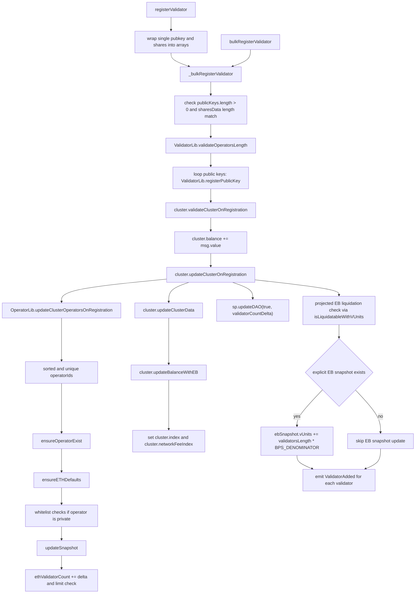
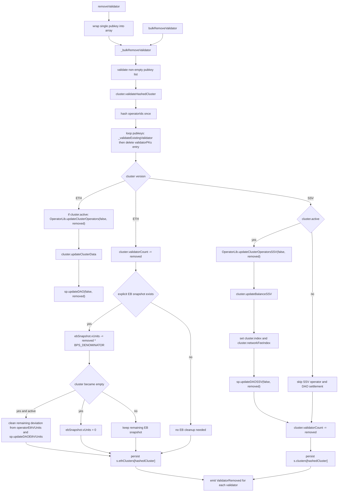
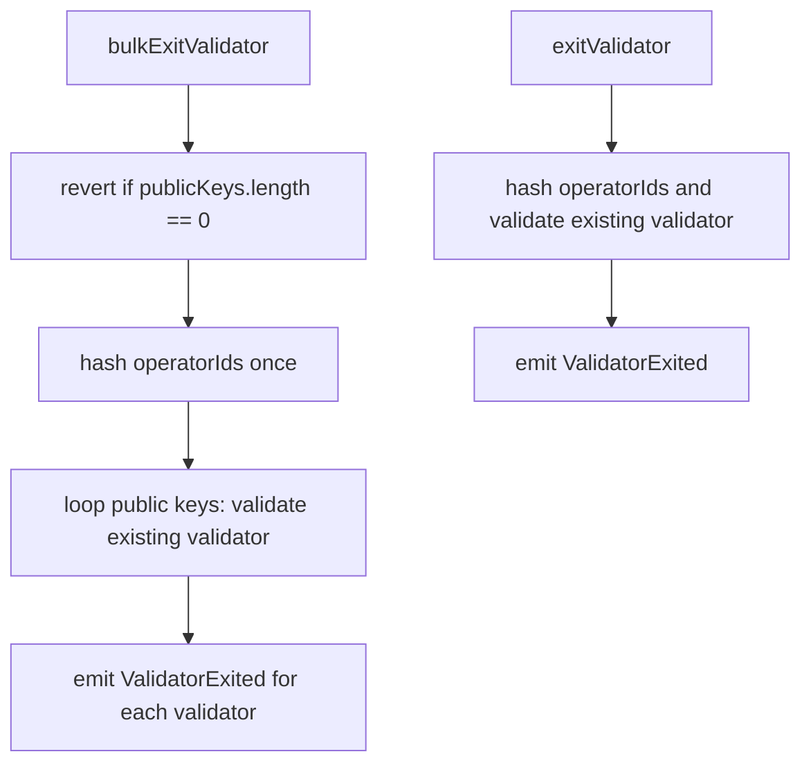

# SSV Network v2.0.0 - Internal Validators Analysis

This document extracts the validator material from [FLOW_DIAGRAMS.md](./FLOW_DIAGRAMS.md). It includes the validator-facing diagrams, entrypoint mapping, and shared helper summaries for the validator module paths.

Section numbering is preserved from the original flow-diagram document so existing `2.x` references remain stable.

## 2. Validator Flows

The validator-facing surface lives in the `SSVValidators` module. `SSVNetwork` delegates those selectors into the validator module wrappers in `contracts/SSVNetwork.sol`.

### 2.1 Validator-Callable Surface

Validator-facing entrypoints:

- Registration: `registerValidator`, `bulkRegisterValidator`
- Removal: `removeValidator`, `bulkRemoveValidator`
- Exit signaling: `exitValidator`, `bulkExitValidator`

Access model:

- Registration and removal are cluster-owner scoped. The cluster is keyed by `(owner, operatorIds)` and validated against the caller-supplied cluster state.
- Exit signaling is also owner scoped because validator storage is keyed by `(publicKey, owner)` and checked against `msg.sender`.

#### Starting Points

Start from the external selector on `SSVNetwork`, then follow the delegate call into `SSVValidators`:

| Function | Entry | Implementation |
|---|---|---|
| `registerValidator(bytes,uint64[],bytes,Cluster)` | [`contracts/SSVNetwork.sol#L237`](../contracts/SSVNetwork.sol#L237) | [`contracts/modules/SSVValidators.sol#L26`](../contracts/modules/SSVValidators.sol#L26) |
| `bulkRegisterValidator(bytes[],uint64[],bytes[],Cluster)` | [`contracts/SSVNetwork.sol#L246`](../contracts/SSVNetwork.sol#L246) | [`contracts/modules/SSVValidators.sol#L44`](../contracts/modules/SSVValidators.sol#L44) |
| `removeValidator(bytes,uint64[],Cluster)` | [`contracts/SSVNetwork.sol#L255`](../contracts/SSVNetwork.sol#L255) | [`contracts/modules/SSVValidators.sol#L56`](../contracts/modules/SSVValidators.sol#L56) |
| `bulkRemoveValidator(bytes[],uint64[],Cluster)` | [`contracts/SSVNetwork.sol#L263`](../contracts/SSVNetwork.sol#L263) | [`contracts/modules/SSVValidators.sol#L70`](../contracts/modules/SSVValidators.sol#L70) |
| `exitValidator(bytes,uint64[])` | [`contracts/SSVNetwork.sol#L328`](../contracts/SSVNetwork.sol#L328) | [`contracts/modules/SSVValidators.sol#L81`](../contracts/modules/SSVValidators.sol#L81) |
| `bulkExitValidator(bytes[],uint64[])` | [`contracts/SSVNetwork.sol#L332`](../contracts/SSVNetwork.sol#L332) | [`contracts/modules/SSVValidators.sol#L91`](../contracts/modules/SSVValidators.sol#L91) |

### 2.2 Register Validator / Bulk Register Validator

### 2.3 Remove Validator / Bulk Remove Validator

### 2.4 Exit Validator / Bulk Exit Validator

### 2.5 Shared Validator Helpers

These are the helper paths most relevant to validator-facing calls:

| Helper | Role |
|---|---|
| `ValidatorLib.validateOperatorsLength` | Enforces the protocol's supported operator-set sizes |
| `ValidatorLib.registerPublicKey` | Validates validator public-key length, enforces owner-scoped uniqueness, and stores the validator/operator binding |
| `ValidatorLib.hashOperatorIds` | Normalizes the operator-set hash used by exit/removal validation |
| `ValidatorLib.validateCorrectState` | Compares stored validator state against the provided operator set |
| `_validateExistingValidator` | Verifies the validator exists for `(publicKey, owner)` and matches the provided operator IDs |
| `ClusterLib.validateClusterOnRegistration` | Confirms registration is happening against a valid ETH cluster state or a zero-state new cluster |
| `ClusterLib.updateClusterOnRegistration` | Updates operator snapshots, cluster indexes, DAO accounting, validator count, and registration-time liquidation checks |
| `ClusterLib.validateHashedCluster` | Confirms the supplied cluster matches stored ETH or legacy SSV cluster state |

### 2.6 Detailed Audit - `registerValidator`

Audit posture for this path:

- No findings under the current intended design.
- Design note: this is a thin single-validator wrapper over `_bulkRegisterValidator`.
- Design note: validator keys are owner-scoped, so the same validator public key can exist under different owners, but not twice for the same owner.

#### Module Body

| Lines | Explanation | Possible problem / audit note |
|---|---|---|
| `26-31` | Declares the external module entrypoint and its arguments. | No issue. |
| `32` | Allocates a one-element array for the single validator public key. | No issue. |
| `33` | Stores the single `publicKey` into the array. | No issue. |
| `35` | Allocates a one-element array for the single validator shares payload. | No issue. |
| `36` | Stores the single `sharesData` blob into the array. | No issue. |
| `38` | Forwards the normalized single-item inputs into `_bulkRegisterValidator`, preserving `msg.sender` and `msg.value`. | No issue. This is the entire behavior of the wrapper. |
| `39` | Function end. | No issue. |

#### Internal Calls Reached By This Path

`_bulkRegisterValidator`

| Lines | Explanation | Possible problem / audit note |
|---|---|---|
| `113` | Reads the number of validators being registered. | No issue. |
| `115` | Rejects an empty public-key list. | No issue. |
| `116` | Rejects mismatched `publicKeys` and `sharesData` lengths. | No issue. |
| `118` | Loads main protocol storage. | No issue. |
| `119` | Loads protocol accounting/config storage. | No issue. |
| `121` | Validates that the operator-set length is one of the supported protocol sizes. | No issue. |
| `123-125` | Loops over each validator public key and registers it against `(publicKey, owner, operatorIds)`. | No issue. |
| `126` | Validates the supplied cluster state for registration and computes the hashed cluster ID. | No issue. |
| `128` | Adds the ETH sent with the transaction to the in-memory cluster balance. | No issue. |
| `130` | Applies registration-side operator/cluster/DAO accounting updates and persists the updated ETH cluster. | No issue. |
| `136-137` | Loads EB storage and the cluster's explicit EB snapshot. | No issue. |
| `138-141` | If the cluster already has explicit EB tracking, adds the new validators' baseline vUnits to the snapshot. | No issue. |
| `145-149` | Emits `ValidatorAdded` once per validator using the post-update cluster snapshot. | No issue. |
| `150` | Helper end. | No issue. |

`SSVStorage.load`

| Lines | Explanation | Possible problem / audit note |
|---|---|---|
| `50-55` | Returns a storage pointer bound to the fixed unstructured-storage slot for main protocol state. | No issue. Standard unstructured-storage pattern. |

`SSVStorageProtocol.load`

| Lines | Explanation | Possible problem / audit note |
|---|---|---|
| `66-71` | Returns a storage pointer bound to the fixed unstructured-storage slot for protocol config/state. | No issue. Standard unstructured-storage pattern. |

`ValidatorLib.validateOperatorsLength`

| Lines | Explanation | Possible problem / audit note |
|---|---|---|
| `22-24` | Reads the operator-set length. | No issue. |
| `25-31` | Enforces the protocol's supported operator counts: at least 4, at most 13, and `length % 3 == 1`. | No issue. |

`ValidatorLib.registerPublicKey`

| Lines | Explanation | Possible problem / audit note |
|---|---|---|
| `47-49` | Rejects validator public keys that are not exactly 48 bytes. | No issue. |
| `51` | Hashes the validator key together with the owner address. | No issue. This is the owner-scoped uniqueness model. |
| `53-55` | Rejects duplicate validator registration for the same `(publicKey, owner)` pair. | No issue. |
| `57` | Stores the normalized operator-set hash with the low bit marked as present. | No issue. |

`ClusterLib.validateClusterOnRegistration`

| Lines | Explanation | Possible problem / audit note |
|---|---|---|
| `199` | Computes the cluster ID from `(owner, operatorIds)`. | No issue. |
| `201-202` | Loads the ETH-cluster and legacy SSV-cluster storage slots for the same cluster ID. | No issue. |
| `204-206` | Rejects registration into a legacy SSV cluster. | No issue. |
| `208-217` | For a new ETH cluster, requires the supplied cluster struct to be exactly the zero-state active cluster. | No issue. |
| `218-219` | For an existing ETH cluster, rejects any mismatched cluster state. | No issue. |
| `220-221` | For an existing matching ETH cluster, rejects registration into a liquidated cluster. | No issue. |

`ClusterLib.updateClusterOnRegistration`

| Lines | Explanation | Possible problem / audit note |
|---|---|---|
| `242-247` | Updates all cluster operators for the incoming validator count and derives the cumulative ETH index and burn rate. | No issue. |
| `249` | Recomputes the cluster balance and writes the current operator and network indexes into the in-memory cluster. | No issue. |
| `251` | Updates DAO ETH earnings and validator/vUnit counts for the new validators. | No issue. |
| `253` | Increments the cluster's validator count. | No issue. |
| `256-260` | Reads existing EB tracking and computes the post-registration projected vUnits. | No issue. |
| `262-273` | Rejects the registration if the updated cluster would already be liquidatable under the projected vUnits and current burn rate. | No issue. This is the intended post-registration solvency check. |
| `276` | Persists the updated ETH cluster state. | No issue. |

`OperatorLib.updateClusterOperatorsOnRegistration`

| Lines | Explanation | Possible problem / audit note |
|---|---|---|
| `161-166` | Initializes loop state used for operator iteration and whitelist bitmap caching. | No issue. |
| `167-176` | Iterates the operator IDs and enforces sorted order plus uniqueness. | No issue. |
| `177-179` | Loads each operator and rejects missing/removed operators. | No issue. |
| `180` | Lazily initializes ETH defaults for legacy operators that have no ETH-side state yet. | No issue. |
| `181-209` | Copies the operator to memory and enforces whitelist access for private operators, including bitmap, legacy address, and contract-based whitelists. | No issue. |
| `212` | Settles ETH earnings on the memory copy before changing validator count. | No issue. |
| `213-215` | Increments `ethValidatorCount` and enforces the per-operator validator limit. | No issue. |
| `216-217` | Adds the operator fee and index contribution to the cluster-wide cumulative values. | No issue. |
| `219` | Writes the updated operator back to storage. | No issue. |

### 2.7 Detailed Audit - `bulkRegisterValidator`

Audit posture for this path:

- No findings under the current intended design.
- Design note: this is the direct multi-validator entrypoint to the exact same `_bulkRegisterValidator` path documented in `2.6`.

#### Module Body

| Lines | Explanation | Possible problem / audit note |
|---|---|---|
| `44-49` | Declares the external bulk entrypoint and its arguments. | No issue. |
| `50` | Forwards the provided arrays directly into `_bulkRegisterValidator`, preserving `msg.sender` and `msg.value`. | No issue. |
| `51` | Function end. | No issue. |

#### Internal Calls Reached By This Path

- Reaches the exact same internal registration path audited in `2.6 Detailed Audit - registerValidator`.
- The only semantic difference is that the caller supplies the arrays directly instead of the wrapper constructing one-element arrays.

### 2.8 Detailed Audit - `removeValidator`

Audit posture for this path:

- No findings under the current intended design.
- Design note: this is a thin single-validator wrapper over `_bulkRemoveValidator`.
- Design note: ETH and legacy SSV clusters intentionally take different settlement and persistence branches during removal.

#### Module Body

| Lines | Explanation | Possible problem / audit note |
|---|---|---|
| `56-60` | Declares the external module entrypoint and its arguments. | No issue. |
| `61` | Allocates a one-element array for the single validator public key. | No issue. |
| `62` | Stores the single `publicKey` into the array. | No issue. |
| `64` | Forwards the normalized single-item input into `_bulkRemoveValidator`, preserving `msg.sender` as owner. | No issue. |
| `65` | Function end. | No issue. |

#### Internal Calls Reached By This Path

`_bulkRemoveValidator`

| Lines | Explanation | Possible problem / audit note |
|---|---|---|
| `159` | Reads the number of validators being removed. | No issue. |
| `161-163` | Rejects an empty list. | No issue. |
| `164` | Loads main protocol storage. | No issue. |
| `166` | Validates the supplied cluster state and detects whether the stored cluster is ETH or legacy SSV. | No issue. |
| `167` | Pre-hashes the operator-set for repeated validator-state checks. | No issue. |
| `169` | Initializes the removed-validator counter. | No issue. |
| `171-176` | Validates each validator against `(publicKey, owner, operatorIds)`, deletes its storage entry, and counts removals. | No issue. |
| `178` | Starts the ETH-cluster removal branch. | No issue. |
| `179-193` | For active ETH clusters, settles operators, recomputes the cluster balance/indexes, and decrements DAO ETH validator accounting. | No issue. |
| `195` | Decrements the cluster validator count for the removed validators. | No issue. |
| `201-223` | If explicit EB tracking exists, subtracts the removed baseline from the EB snapshot and, when the cluster becomes empty, cleans up any remaining deviation from operators and DAO ETH vUnits. | No issue. |
| `230` | Persists the updated ETH cluster state. | No issue. |
| `231` | Starts the legacy SSV-cluster removal branch. | No issue. |
| `232-247` | For active SSV clusters, settles operators, recomputes SSV balance/indexes, and decrements DAO SSV validator accounting. | No issue. |
| `249-250` | Decrements the legacy cluster validator count and persists the updated SSV cluster state. | No issue. |
| `251-252` | Rejects unsupported cluster versions. | No issue. |
| `255-256` | Emits `ValidatorRemoved` once per removed validator using the post-update cluster snapshot. | No issue. |
| `257` | Helper end. | No issue. |

`ClusterLib.validateHashedCluster`

| Lines | Explanation | Possible problem / audit note |
|---|---|---|
| `137-138` | Computes the cluster ID and hashes the caller-supplied cluster struct. | No issue. |
| `140` | Loads the stored cluster data and detected version. | No issue. |
| `141-145` | Rejects missing clusters and mismatched cluster state. | No issue. |
| `147` | Returns the validated cluster ID and version. | No issue. |

`ValidatorLib.hashOperatorIds`

| Lines | Explanation | Possible problem / audit note |
|---|---|---|
| `66-67` | Hashes the operator-set and clears the low bit so it can be compared against stored validator records. | No issue. |

`_validateExistingValidator`

| Lines | Explanation | Possible problem / audit note |
|---|---|---|
| `266` | Computes the validator key hash from `(publicKey, owner)`. | No issue. |
| `267` | Loads the stored validator data. | No issue. |
| `268-270` | Rejects missing validator records. | No issue. |
| `271-273` | Rejects validators whose stored operator-set does not match the provided operator IDs. | No issue. |

`ValidatorLib.validateCorrectState`

| Lines | Explanation | Possible problem / audit note |
|---|---|---|
| `76-80` | Clears the low-bit presence marker from stored validator data and compares the result to the provided operator-set hash. | No issue. |

`OperatorLib.updateClusterOperators`

| Lines | Explanation | Possible problem / audit note |
|---|---|---|
| `240-243` | Iterates the operator IDs and loads each operator. | No issue. |
| `247-249` | For active ETH operators, settles the ETH snapshot to the current block. | No issue. |
| `250-256` | Adjusts `ethValidatorCount` up or down depending on the call mode. In validator removal this is always the decrement path. | No issue. |
| `258-260` | Accumulates fee and index contributions for cluster settlement. | No issue. |

`OperatorLib.updateClusterOperatorsSSV`

| Lines | Explanation | Possible problem / audit note |
|---|---|---|
| `403-408` | Iterates the operator IDs and loads each operator. | No issue. |
| `410-411` | For active legacy operators, settles the SSV snapshot to the current block. | No issue. |
| `412-416` | Adjusts `validatorCount` up or down depending on the call mode. In validator removal this is always the decrement path. | No issue. |
| `418-421` | Accumulates SSV fee and index contributions for cluster settlement. | No issue. |

`ProtocolLib.currentNetworkFeeIndex`, `ProtocolLib.currentNetworkFeeIndexSSV`, `ProtocolLib.updateDAO`, `ProtocolLib.updateDAOSSV`, and `ProtocolLib.updateDAOEthVUnits`

| Lines | Explanation | Possible problem / audit note |
|---|---|---|
| `22-24` | Computes the current ETH network fee index used during ETH cluster settlement. | No issue. |
| `31-33` | Computes the current SSV network fee index used during legacy SSV cluster settlement. | No issue. |
| `107-119` | Settles ETH DAO earnings and adjusts ETH validator/vUnit counts during ETH validator removal. | No issue. |
| `127-134` | Settles SSV DAO earnings and adjusts SSV validator count during legacy removal. | No issue. |
| `142-149` | Adjusts only DAO ETH vUnits when empty-cluster deviation cleanup runs. | No issue. |

### 2.9 Detailed Audit - `bulkRemoveValidator`

Audit posture for this path:

- No findings under the current intended design.
- Design note: this is the direct multi-validator entrypoint to the exact same `_bulkRemoveValidator` path documented in `2.8`.

#### Module Body

| Lines | Explanation | Possible problem / audit note |
|---|---|---|
| `70-74` | Declares the external bulk entrypoint and its arguments. | No issue. |
| `75` | Forwards the provided arrays directly into `_bulkRemoveValidator`, preserving `msg.sender` as owner. | No issue. |
| `76` | Function end. | No issue. |

#### Internal Calls Reached By This Path

- Reaches the exact same internal removal path audited in `2.8 Detailed Audit - removeValidator`.
- The only semantic difference is that the caller supplies the public-key array directly instead of the wrapper constructing one.

### 2.10 Detailed Audit - `exitValidator`

Audit posture for this path:

- No findings under the current intended design.
- Design note: exit is intentionally a pure on-chain signal. It validates ownership/state and emits `ValidatorExited`, but does not remove the validator or change cluster accounting.

#### Module Body

| Lines | Explanation | Possible problem / audit note |
|---|---|---|
| `81` | Declares the external module entrypoint. | No issue. |
| `82` | Loads main protocol storage. | No issue. |
| `83` | Hashes the operator-set and validates that the validator exists for `(publicKey, msg.sender)` with the matching operator IDs. | No issue. |
| `85` | Emits `ValidatorExited`. | No issue. |
| `86` | Function end. | No issue. |

#### Internal Calls Reached By This Path

`SSVStorage.load`

| Lines | Explanation | Possible problem / audit note |
|---|---|---|
| `50-55` | Returns a storage pointer bound to the fixed unstructured-storage slot for main protocol state. | No issue. Standard unstructured-storage pattern. |

`ValidatorLib.hashOperatorIds`

| Lines | Explanation | Possible problem / audit note |
|---|---|---|
| `66-67` | Hashes the operator-set and clears the low bit so it matches the stored validator format. | No issue. |

`_validateExistingValidator`

| Lines | Explanation | Possible problem / audit note |
|---|---|---|
| `266` | Computes the validator key hash from `(publicKey, owner)`. | No issue. |
| `267` | Loads the stored validator data. | No issue. |
| `268-270` | Rejects missing validator records. | No issue. |
| `271-273` | Rejects validators whose stored operator-set does not match the provided operator IDs. | No issue. |

`ValidatorLib.validateCorrectState`

| Lines | Explanation | Possible problem / audit note |
|---|---|---|
| `76-80` | Clears the low-bit presence marker from stored validator data and compares the result to the provided operator-set hash. | No issue. |

### 2.11 Detailed Audit - `bulkExitValidator`

Audit posture for this path:

- No findings under the current intended design.
- Design note: this is the bulk event-signaling variant of `exitValidator`, so it validates each validator and emits one `ValidatorExited` event per key without changing storage.

#### Module Body

| Lines | Explanation | Possible problem / audit note |
|---|---|---|
| `91` | Declares the external bulk entrypoint. | No issue. |
| `92-94` | Rejects an empty public-key list. | No issue. |
| `95` | Loads main protocol storage. | No issue. |
| `96` | Hashes the operator-set once and reuses it for the full loop. | No issue. |
| `98-102` | Validates each validator against `(publicKey, msg.sender, operatorIds)` and emits `ValidatorExited` once per key. | No issue. |
| `103` | Function end. | No issue. |

#### Internal Calls Reached By This Path

- Reaches the exact same `_validateExistingValidator`, `ValidatorLib.hashOperatorIds`, and `ValidatorLib.validateCorrectState` paths audited in `2.10 Detailed Audit - exitValidator`.
- The only semantic difference is that the validation/emission path runs in a loop over all provided validator public keys.
