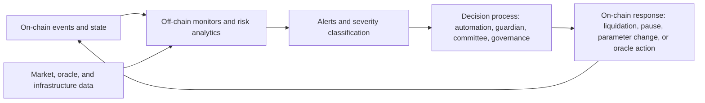

# Behavioral Anomaly Detection On-Chain

## Alerting and Monitoring Patterns in DeFi Protocols

Last reviewed: 2026-04-27

## Executive Summary

Large DeFi protocols generally do not rely on a single fully on-chain anomaly detector. The dominant architecture is hybrid: off-chain systems observe complex behavior and market conditions, while on-chain contracts enforce deterministic controls such as liquidations, oracle sanity checks, circuit breakers, pause roles, and governance-controlled parameter changes.

The strongest recurring pattern is:

```text
detection layer -> alerting layer -> decision layer -> execution layer
```

Detection and alerting are often off-chain because they require flexible data processing, market context, historical baselines, simulations, and human-readable triage. Execution is usually on-chain because protocol safety actions must be deterministic, auditable, and enforceable by smart contracts.

For protocol design, the practical conclusion is that "behavioral anomaly detection on-chain" should usually mean:

- Keep expensive or fuzzy detection logic off-chain.
- Keep enforcement rules simple, bounded, and on-chain.
- Expose enough events and state for independent monitors to reconstruct risk.
- Define privileged response paths with clear scope, time limits, and governance oversight.
- Treat external monitoring tools as support infrastructure, not as substitutes for protocol-native safety controls.

## Research Scope

This document reviews monitoring, alerting, and response patterns across selected DeFi protocols and operational tooling:

- Protocols: Lido, Maple Finance, Aave, MakerDAO, Compound
- Tools: Tenderly, OpenZeppelin Defender and Monitor, Forta Network

The goal is not to rank protocols. The goal is to identify reusable design patterns for on-chain behavioral anomaly detection and incident response.

## Methodology

This review uses public documentation, governance materials, and official product documentation. Protocol-specific conclusions are conservative: if a source documents a response mechanism but not a full monitoring pipeline, this document describes only what is evidenced and separates source-backed facts from analysis.

Key source categories:

- Protocol documentation for liquidation, oracle, pause, and governance mechanisms
- Risk-management and operational documents
- Tool documentation for alerting, monitoring, simulation, and automated actions
- Author analysis based on the cited sources

## Named Tooling Disclosed Publicly

The biggest protocols often disclose less about their exact operational stack than teams expect. Based on the public materials reviewed here, Maple and Aave differ in how specific they are:

| Protocol | Publicly named tooling | What appears custom or provider-operated | Practical reading |
|---|---|---|---|
| Maple | Tenderly Web3 Actions | Proprietary alert system, internal operational monitoring, three independent price-feed sources | Maple publicly confirms at least one concrete third-party workflow for invariant checks, but much of its alerting stack remains internal |
| Aave | Chaos Labs Risk Oracles historically; current transition toward LlamaRisk infrastructure on Chainlink CRE; Tenderly is also documented for governance simulation workflows | Core risk monitoring, anomaly detection, risk recommendations, guardian escalation, and parameter management | Aave does not present one packaged alerting product as its core monitoring engine; the public record points to custom or provider-run risk infrastructure instead |

This distinction matters. When a protocol says it has "monitoring" or "risk systems," that often means custom analytics, provider-operated bots, simulation pipelines, and governance-linked escalation paths rather than a simple off-the-shelf monitoring product.

## Common Architecture

Most systems can be mapped into four layers:

| Layer | Purpose | Common implementation |
|---|---|---|
| Detection | Identify unusual protocol, market, oracle, or governance behavior | Off-chain bots, risk dashboards, simulation engines, keeper systems, scan nodes |
| Alerting | Notify operators, contributors, or subscribers | PagerDuty, Slack, Telegram, email, webhooks, dashboards, Forta alerts |
| Decision | Determine whether an anomaly requires action | Risk teams, governance, guardians, committees, automated threshold rules |
| Execution | Apply a safety response | Liquidation, auction, pause, freeze, grace period, parameter update, oracle stop, governance proposal |

The architecture is hybrid because each layer has different constraints. Detection benefits from flexibility. Execution benefits from determinism and auditability.



## Protocol Analysis

### Lido

#### Monitoring and Alerting

Lido documents a broad security process for technical releases, including deployment supervision, alerts, audits, bug bounty coverage, and post-deployment checks. Its risk documentation identifies oracle data manipulation, validator slashing, smart contract, and Ethereum dependency risks. The Lido protocol also includes oracle-specific mitigations such as the `OracleReportSanityChecker`, which performs on-chain sanity checks on oracle reports before they affect protocol accounting.

Key references:

- [Lido Security Practices and Processes](https://lido.fi/how-lido-works/security-practices-and-processes)
- [Lido Known Risks and Mitigations](https://lido.fi/how-lido-works/known-risks-and-mitigations)
- [Lido OracleReportSanityChecker](https://docs.lido.fi/contracts/oracle-report-sanity-checker/)
- [Lido Protocol Levers](https://docs.lido.fi/guides/protocol-levers/)

#### Response Mechanism

Lido uses governance and committee-based emergency controls. The GateSeal mechanism is documented as a one-time emergency pause mechanism for protected contracts, intended to provide time for investigation and governance action. Lido protocol levers also document role-based pause and resume controls, where emergency mechanisms can pause selected components and DAO governance remains responsible for broader protocol control and resumption.

Key references:

- [Lido GateSeal](https://docs.lido.fi/contracts/gate-seal/)
- [Lido Emergency Brakes](https://docs.lido.fi/multisigs/emergency-brakes/)
- [Lido Committees](https://docs.lido.fi/multisigs/committees/)
- [Lido stETH Superuser Functions](https://docs.lido.fi/token-guides/steth-superuser-functions)

#### Analysis

| Strengths | Constraints |
|---|---|
| Strong documented release and security process | Emergency response still involves human and governance coordination |
| Explicit oracle sanity checks | Operational model spans multiple committees, roles, and contracts |
| Time-limited emergency pause mechanism | Pausing is a defensive response, not a root-cause fix |
| Clear distinction between emergency action and normal governance | Governance resumption can be slower than automated execution |

Lido is a strong example of protocol-native safeguards combined with governance and emergency controls. Its approach is not a pure anomaly-detection system; it is a layered risk-control system.

### Maple Finance

#### Monitoring and Alerting

Maple publicly documents two monitoring layers. First, Maple's operations team uses a proprietary alert system with three separate price-feed sources and a 24/7/365 live monitoring process for margin-call and liquidation workflows. Second, Maple's security documentation states that it uses a custom smart contract to check invariants using both smart contract and subgraph data, and that this invariant-checking flow is managed with Tenderly Web3 Actions. Maple says these invariants are checked atomically every block at the Loan, Pool, and LP level.

Key references:

- [Maple Margin Calls and Liquidations](https://docs.maple.finance/maple-for-lenders/defaults-and-impairments-1)
- [Maple Yield Generation, Underwriting and Risk Management](https://maple.finance/news/yield-generation-underwriting-and-risk-management)
- [Maple August Market Update: Resilience Amid Turbulence](https://maple.finance/insights/august-market-update-resilience-amid-turbulence)
- [Maple FAQ](https://docs.maple.finance/faq)
- [Maple Security](https://docs.maple.finance/technical-resources/security/security)

#### Response Mechanism

Maple describes borrower notifications at margin-call thresholds, a 24-hour cure period to restore collateralization, and liquidation if collateral is not restored. Maple also describes the ability to liquidate via OTC desks, centralized exchanges, or decentralized exchanges, depending on market conditions.

#### Analysis

| Strengths | Constraints |
|---|---|
| Clearly documented continuous monitoring and margin-call process | Strong dependence on off-chain operations |
| Publicly disclosed Tenderly Web3 Actions workflow for invariant checks | Core alerting stack remains partly proprietary |
| Multiple price-feed sources | More centralized operational model than fully permissionless DeFi systems |
| Practical liquidation execution paths during volatility | Legal agreements and custody workflows add operational complexity |
| Human risk management can handle nuanced credit conditions | Not a general-purpose on-chain anomaly detection model |

Maple is useful as a case study in operational risk management. It demonstrates strong monitoring and response discipline, but much of the detection and response path is off-chain and institutionally operated.

### Aave

#### Monitoring and Alerting

Aave documents health-factor-based liquidation logic, where a position becomes liquidatable once its health factor falls below 1. Public Aave materials do not describe one generic off-the-shelf alerting product as the core of its risk stack. Instead, they describe custom and provider-operated risk infrastructure.

Historically, Aave governance materials show Chaos Labs operating a Risk Oracle framework. In April 2024, Chaos Labs described an off-chain workflow running in "Chaos Cloud" that continuously monitored utilization, cap thresholds, volatility, and anomalous user behavior, then produced risk recommendations for on-chain validation through Aave's Risk Stewards framework. Chaos Labs also operated a Parameter Recommendation Platform and Asset Listing Portal for the Aave community.

As of April 2026, Aave governance materials show an active transition away from Chaos Labs. Chaos Labs announced its departure on 2026-04-06, and subsequent Aave governance posts state that LlamaRisk is absorbing the departing functions. LlamaRisk describes its current direction as protocol-owned risk infrastructure built on Chainlink CRE, including LlamaGuard NAV and automated alerting for oracle deviations, utilization spikes, liquidation cascades, and parameter-update anomalies.

Key references:

- [Aave Health Factor and Liquidations](https://aave.com/help/borrowing/liquidations)
- [Aave Community and Governance](https://aave.com/help/governance/aave-community)
- [Chaos Labs Risk Oracles](https://governance.aave.com/t/chaos-labs-risk-oracles/17216)
- [Chaos Labs Asset Listing Portal](https://governance.aave.com/t/chaos-labs-asset-listing-portal/13064)
- [Aave Liquidations Grace Sentinel Proposal](https://governance-v2.aave.com/governance/proposal/361/)
- [Aave ARFC: Authorizing Use of Grace Sentinel](https://governance.aave.com/t/arfc-authorizing-use-of-grace-sentinel/15447)
- [Chaos Labs Is Leaving Aave](https://governance.aave.com/t/chaos-labs-is-leaving-aave/24386)
- [Orderly Transition and Offboarding Plan for Chaos Labs](https://governance.aave.com/t/orderly-transition-and-offboarding-plan-for-chaos-labs/24399)
- [LlamaRisk: Ensuring Continuity of Aave's Risk Management](https://governance.aave.com/t/llamarisk-ensuring-continuity-of-aaves-risk-management/24397)
- [Renew LlamaRisk as Risk Service Provider - epoch 4](https://governance.aave.com/t/arfc-renew-llamarisk-as-risk-service-provider-epoch-4/24446)

#### Response Mechanism

Aave's primary protocol-native enforcement mechanism is liquidation. Liquidations are permissionless when a position is unhealthy. Separately, governance and guardian-related mechanisms can support emergency responses such as pausing markets, using grace-period mechanisms, or freezing affected assets. Recent governance incident reporting shows this operating model in practice: on 2026-04-18, Aave governance reported that the Guardian froze rsETH and wrsETH markets after being alerted to a potential exploit involving the asset.

Additional reference:

- [rsETH incident - 2026-04-18](https://governance.aave.com/t/rseth-incident-2026-04-18/24481)

#### Analysis

| Strengths | Constraints |
|---|---|
| Strong on-chain enforcement through deterministic liquidation rules | Some responses depend on governance, guardians, or service-provider recommendations |
| Clear risk metric through health factor | Risk-parameter quality depends on modeling and governance process |
| Publicly documented custom risk-oracle and risk-provider infrastructure | Tooling is spread across multiple providers, roles, and governance processes |
| Permissionless liquidator participation | Fast market shocks can stress oracle, liquidity, and bot infrastructure |
| Current direction is toward protocol-owned off-chain risk infrastructure | April 2026 transition creates temporary operational complexity |
| Emergency mechanisms exist for exceptional cases | Emergency intervention introduces coordination and latency |

Aave is a canonical example of deterministic on-chain enforcement supported by off-chain risk analysis. It does not require a central monitor to execute ordinary liquidations, but it does rely on a broader ecosystem for monitoring, parameter management, and emergency handling.

### MakerDAO

#### Monitoring and Alerting

MakerDAO documents an oracle and keeper architecture. The Oracle Security Module delays oracle updates before they are consumed by the system, creating time to detect and react to oracle manipulation. Maker documentation also explains that keepers monitor Vaults, price feeds, and auction opportunities.

Key references:

- [Maker Oracle Module](https://docs.makerdao.com/smart-contract-modules/oracle-module)
- [Maker Oracle Security Module](https://docs.makerdao.com/smart-contract-modules/oracle-module/oracle-security-module-osm-detailed-documentation)
- [The Auctions of the Maker Protocol](https://docs.makerdao.com/keepers/the-auctions-of-the-maker-protocol)
- [Maker Auction Keeper Bot Setup Guide](https://docs.makerdao.com/keepers/auction-keepers/auction-keeper-bot-setup-guide)

#### Response Mechanism

Maker's liquidation system transfers collateral from unsafe Vaults and starts auctions. Liquidation 2.0 uses Dutch auctions, and keepers participate in liquidation and auction workflows. The OSM also exposes administrative controls such as stopping updates, depending on authorization.

Key reference:

- [Maker Liquidation 2.0 Module](https://docs.makerdao.com/smart-contract-modules/dog-and-clipper-detailed-documentation)

#### Analysis

| Strengths | Constraints |
|---|---|
| Mature oracle-delay and liquidation-auction architecture | OSM delay can slow reaction to legitimate new market prices |
| Explicit keeper role for monitoring and execution | System complexity is high |
| On-chain auction mechanics are transparent | Keeper participation and market liquidity are critical |
| Oracle delay creates time for intervention | Severe market dislocation can still create bad-debt risk |

Maker shows how anomaly response can be embedded into protocol economics: unsafe positions move into liquidation and auction flows, while external keepers provide monitoring and execution pressure.

### Compound

#### Monitoring and Alerting

Compound documents the Comptroller as the risk-management layer for Compound v2. It determines collateral requirements and liquidation eligibility. Compound governance documentation also documents Pause Guardian controls. Compared with some peers, public documentation focuses more on protocol risk controls and governance permissions than on a detailed external alerting stack.

Key references:

- [Compound v2 Comptroller](https://docs.compound.finance/v2/comptroller)
- [Compound v2 Governance](https://docs.compound.finance/v2/governance)
- [Compound III Governance](https://docs.compound.finance/governance/)

#### Response Mechanism

Compound uses collateral checks and liquidation eligibility as normal protocol enforcement. It also documents Pause Guardian authority to disable selected protocol actions in response to unforeseen vulnerabilities. In Compound III, governance documentation describes pausing selected functions such as supply, transfer, withdraw, absorb, and buy.

#### Analysis

| Strengths | Constraints |
|---|---|
| Simple and legible protocol risk-management layer | Less public detail on external monitoring infrastructure |
| Well-defined emergency pause authority | Pause authority is privileged and must be secured |
| Clear separation between protocol checks and governance controls | Delayed action remains possible during fast incidents |
| Easy to reason about compared with more complex systems | Simplicity may limit adaptive anomaly detection |

Compound illustrates a minimal and understandable safety model: deterministic risk checks plus a privileged emergency control path.

## Tooling Analysis

### Tenderly

Tenderly documents simulation, debugging, monitoring, alerting, and Web3 Actions. Tenderly is best understood as an external observability and simulation layer. It can help teams simulate transactions, watch contracts, and route alerts or automated responses, but it is not a protocol-native risk engine by itself.

Key reference:

- [Tenderly Documentation](https://docs.tenderly.co/)

| Strengths | Constraints |
|---|---|
| Strong simulation and debugging workflows | External service dependency |
| Useful for transaction and contract monitoring | Deep protocol-specific detection requires custom logic |
| Can support alert-response workflows | Does not replace on-chain safety mechanisms |

#### How It Works In Practice

Tenderly supports two relevant monitoring patterns:

- Alert-first monitoring, where Tenderly evaluates an on-chain trigger such as a transaction failure, event emission, state change, or view-function threshold and routes the alert to Slack, PagerDuty, webhooks, or Web3 Actions
- Action-first monitoring, where a Web3 Action runs custom JavaScript or TypeScript on a trigger such as a new block, then performs arbitrary RPC reads and throws or escalates if an invariant fails

For simple invariants, Tenderly's `View Function` alert can be enough. For protocol-specific checks that combine multiple reads, logs, or custom logic, Web3 Actions are the better fit.

#### Pricing and Reliability Notes

Tenderly's public pricing pages are partially dynamic, so exact current dollar pricing was not verifiable from static public pages during this review. What is verifiable from official Tenderly sources is that free access includes `25 million` Tenderly Units per month for Node access, while the Pro plan includes `350 million` Tenderly Units per month, soft limits, and higher operational capacity.

Tenderly also publishes a public status page with per-product and per-network uptime data. At review time on 2026-04-27, the status page reported all systems operational and exposed 90-day uptime figures for Alerts and Web3 Actions. This is strong enough to justify a PoC, but it should still be treated as an external dependency rather than a sole line of defense.

#### SSV PoC Fit

For the current rollout, the first Tenderly artifact in this repository is a simple Hoodi stage alert pack for direct ETH-outflow functions on the `SSVNetwork` proxy. The implementation notes live in [direct-eth-outflow-basic-alert.md](../scripts/monitoring/direct-eth-outflow-basic-alert.md).

### OpenZeppelin Defender and Monitor

OpenZeppelin Defender documentation describes monitoring, alerts, Actions, Workflows, and Relayers. Defender Monitor can trigger notifications and automated actions. As of this review date, OpenZeppelin's own documentation states that Defender is in maintenance mode, with new sign-ups disabled as of 2025-06-30 and final shutdown planned for 2026-07-01. For new monitoring infrastructure, OpenZeppelin points users toward OpenZeppelin Monitor and related open-source tooling.

Key references:

- [OpenZeppelin Defender](https://docs.openzeppelin.com/defender)
- [OpenZeppelin Defender Monitor](https://docs.openzeppelin.com/defender/module/monitor)
- [OpenZeppelin Defender Actions](https://docs.openzeppelin.com/defender/module/actions)
- [OpenZeppelin Monitor](https://docs.openzeppelin.com/monitor)
- [OpenZeppelin Defender Migration Guide](https://docs.openzeppelin.com/defender/migration)

| Strengths | Constraints |
|---|---|
| Strong operational model for alerts and automated actions | Defender product lifecycle limits new long-term adoption |
| Monitor categories map well to governance, access control, financial, and technical risks | External monitoring cannot replace protocol-native controls |
| OpenZeppelin Monitor offers self-hosted monitoring direction | Self-hosting adds operational burden |

### Forta Network

Forta documents a decentralized monitoring network made of detection bots and scan nodes. Bots monitor transactions, state changes, and other chain activity, then emit alerts. Users can subscribe to bot alerts and integrate those alerts through the Forta app or API.

Key references:

- [Forta Network Overview](https://docs.forta.network/en/latest/network-overview/)
- [How Forta Works](https://docs.forta.network/en/latest/how-forta-works/)
- [Forta Getting Started](https://docs.forta.network/en/latest/getting-started/)

| Strengths | Constraints |
|---|---|
| Decentralized detection model | Alert quality depends on bot quality and maintenance |
| Protocol-specific bots can be developed | Forta does not directly enforce protocol responses |
| Broad ecosystem visibility | Alert fatigue and false positives are possible |
| Useful independent monitoring layer | Attackers may adapt around known detection rules |

## Comparative Summary

| System | Primary detection style | Alerting style | Execution style | Automation level |
|---|---|---|---|---|
| Lido | Oracle checks, process controls, off-chain review | Operational alerts and committee/governance escalation | Pause, GateSeal, oracle sanity checks, DAO action | Hybrid |
| Maple | Proprietary price-feed monitoring plus Tenderly-managed invariant checks | Proprietary alerts, borrower notifications | Margin calls, collateral liquidation via operational process | Operational/off-chain heavy |
| Aave | Custom risk oracles, provider analytics, liquidator bots | Governance, risk-provider, and guardian workflows | Permissionless liquidation, freeze, pause, and grace mechanisms | High for ordinary liquidations, hybrid for emergencies |
| MakerDAO | Oracle delay, keeper monitoring, auction state tracking | Keeper and governance/operator monitoring | Liquidation auctions, OSM controls | High for liquidation mechanics, keeper-dependent |
| Compound | Comptroller risk checks, governance monitoring | Guardian/governance response | Liquidation eligibility, selected pause controls | Moderate |
| Tenderly | External contract and transaction monitoring | Dashboards, alerts, webhooks, actions | External automation support | Tooling-dependent |
| OpenZeppelin Monitor | Configurable on-chain activity monitoring | Notifications and custom integrations | External automation or relayer integration | Tooling-dependent |
| Forta | Decentralized bot-based detection | Alert subscriptions and API feeds | No native enforcement | Detection-focused |

## Key Findings

### 1. Fully on-chain behavioral detection is uncommon

Protocols rarely implement complex anomaly detection entirely on-chain because behavioral detection often needs historical context, market data, simulations, heuristics, and fast iteration. These are expensive and hard to maintain inside smart contracts.

### 2. On-chain enforcement is usually deterministic

The on-chain layer typically enforces simple rules:

- Health factor below threshold
- Collateralization below required ratio
- Oracle report outside sanity bounds
- Auction eligibility
- Function paused or unpaused
- Guardian, committee, or governance authorization

This keeps the enforcement surface auditable and reduces ambiguity.

### 3. Emergency powers are common but scoped

Lido, Aave, Compound, and Maker all document some form of privileged or governance-controlled emergency mechanism. The better patterns include:

- Narrow permissions
- Time limits
- One-time use where appropriate
- Governance-controlled resumption
- Public documentation of roles and powers

### 4. Off-chain monitoring remains essential

Off-chain systems detect conditions that smart contracts cannot efficiently evaluate:

- Market liquidity changes
- Oracle or data-source anomalies
- Bot liveness failures
- Governance proposal risk
- Unusual account behavior
- Cross-protocol contagion
- Validator or infrastructure incidents

### 5. External tools are support layers, not safety guarantees

Tenderly, OpenZeppelin Monitor, and Forta can materially improve observability and response time. They should be treated as defense-in-depth layers. Protocol-critical safety should not depend on a single external service being available.

## Design Implications for On-Chain Anomaly Detection

### Recommended Target Architecture

An effective architecture should separate detection, decision, and enforcement:

| Component | Recommendation |
|---|---|
| Protocol events | Emit complete, indexed events for risk-relevant state transitions |
| Off-chain detectors | Use multiple monitors for behavior, market, oracle, and governance anomalies |
| Alert routing | Classify severity and route to appropriate responders |
| Response policy | Predefine which alerts require automation, human confirmation, committee action, or governance |
| On-chain controls | Keep enforcement functions narrow, tested, and permissioned where needed |
| Runbooks | Maintain incident runbooks for pause, unpause, parameter changes, and post-mortems |
| Redundancy | Avoid reliance on a single monitor, RPC provider, oracle source, or alerting vendor |

### Candidate Detection Signals

Behavioral monitors can track:

- Sudden changes in collateralization, health factors, or liquidation eligibility
- Oracle report deviations from expected bounds
- Abnormal pause, role, ownership, or governance actions
- Large withdrawals, deposits, borrows, repayments, or liquidations
- Keeper, liquidator, or bot inactivity
- Repeated failed transactions against critical contracts
- Abnormal gas spikes affecting required keepers or liquidators
- Cross-chain bridge message delays or mismatches
- Validator, operator, or staking-related anomalies where applicable

### Candidate On-Chain Controls

Smart contracts can safely enforce:

- Circuit breakers for critical flows
- Rate limits for sensitive operations
- Sanity bounds for oracle or accounting inputs
- Pause and resume controls with role separation
- Time-limited emergency seals
- Grace periods after emergency unpauses
- Deterministic liquidation or auction eligibility
- Governance delay and timelock requirements

### Anti-Patterns

Avoid these designs:

- A single off-chain alerting vendor as the only detection path
- Fully automated privileged actions with no delay, scope limit, or override
- Complex ML-style scoring inside contracts
- Pause controls without a documented unpause path
- Emergency roles without public ownership and permission documentation
- Detection rules that cannot be tested against historical incidents
- Alerts without runbooks or named responders

## Practical Recommendation

For most DeFi protocols, the safest architecture is not "put anomaly detection on-chain." It is:

1. Put invariant enforcement and bounded safety controls on-chain.
2. Put behavioral detection, simulations, and correlation logic off-chain.
3. Connect the two through explicit runbooks, narrow roles, audited emergency functions, and public observability.

This approach reflects the strongest documented practices across the reviewed systems. It keeps smart contracts deterministic while still allowing teams and independent monitors to detect complex behavior in real time.

## Source Index

### Protocols

- Lido: [Security Practices and Processes](https://lido.fi/how-lido-works/security-practices-and-processes), [Known Risks and Mitigations](https://lido.fi/how-lido-works/known-risks-and-mitigations), [OracleReportSanityChecker](https://docs.lido.fi/contracts/oracle-report-sanity-checker/), [Protocol Levers](https://docs.lido.fi/guides/protocol-levers/), [GateSeal](https://docs.lido.fi/contracts/gate-seal/), [Emergency Brakes](https://docs.lido.fi/multisigs/emergency-brakes/), [Committees](https://docs.lido.fi/multisigs/committees/)
- Maple: [Margin Calls and Liquidations](https://docs.maple.finance/maple-for-lenders/defaults-and-impairments-1), [Yield Generation, Underwriting and Risk Management](https://maple.finance/news/yield-generation-underwriting-and-risk-management), [August Market Update](https://maple.finance/insights/august-market-update-resilience-amid-turbulence), [FAQ](https://docs.maple.finance/faq), [Security](https://docs.maple.finance/technical-resources/security/security)
- Aave: [Health Factor and Liquidations](https://aave.com/help/borrowing/liquidations), [Community and Governance](https://aave.com/help/governance/aave-community), [Chaos Labs Risk Oracles](https://governance.aave.com/t/chaos-labs-risk-oracles/17216), [Chaos Labs Asset Listing Portal](https://governance.aave.com/t/chaos-labs-asset-listing-portal/13064), [Liquidations Grace Sentinel Proposal](https://governance-v2.aave.com/governance/proposal/361/), [ARFC: Authorizing Use of Grace Sentinel](https://governance.aave.com/t/arfc-authorizing-use-of-grace-sentinel/15447), [Chaos Labs Is Leaving Aave](https://governance.aave.com/t/chaos-labs-is-leaving-aave/24386), [Orderly Transition and Offboarding Plan for Chaos Labs](https://governance.aave.com/t/orderly-transition-and-offboarding-plan-for-chaos-labs/24399), [LlamaRisk: Ensuring Continuity of Aave's Risk Management](https://governance.aave.com/t/llamarisk-ensuring-continuity-of-aaves-risk-management/24397), [Renew LlamaRisk as Risk Service Provider - epoch 4](https://governance.aave.com/t/arfc-renew-llamarisk-as-risk-service-provider-epoch-4/24446), [rsETH incident - 2026-04-18](https://governance.aave.com/t/rseth-incident-2026-04-18/24481)
- MakerDAO: [Oracle Module](https://docs.makerdao.com/smart-contract-modules/oracle-module), [Oracle Security Module](https://docs.makerdao.com/smart-contract-modules/oracle-module/oracle-security-module-osm-detailed-documentation), [Liquidation 2.0 Module](https://docs.makerdao.com/smart-contract-modules/dog-and-clipper-detailed-documentation), [Auctions of the Maker Protocol](https://docs.makerdao.com/keepers/the-auctions-of-the-maker-protocol), [Auction Keeper Bot Setup Guide](https://docs.makerdao.com/keepers/auction-keepers/auction-keeper-bot-setup-guide)
- Compound: [v2 Comptroller](https://docs.compound.finance/v2/comptroller), [v2 Governance](https://docs.compound.finance/v2/governance), [Compound III Governance](https://docs.compound.finance/governance/)

### Tools

- Tenderly: [Documentation](https://docs.tenderly.co/)
- OpenZeppelin: [Defender](https://docs.openzeppelin.com/defender), [Defender Monitor](https://docs.openzeppelin.com/defender/module/monitor), [Defender Actions](https://docs.openzeppelin.com/defender/module/actions), [OpenZeppelin Monitor](https://docs.openzeppelin.com/monitor), [Defender Migration Guide](https://docs.openzeppelin.com/defender/migration)
- Forta: [Network Overview](https://docs.forta.network/en/latest/network-overview/), [How Forta Works](https://docs.forta.network/en/latest/how-forta-works/), [Getting Started](https://docs.forta.network/en/latest/getting-started/)
